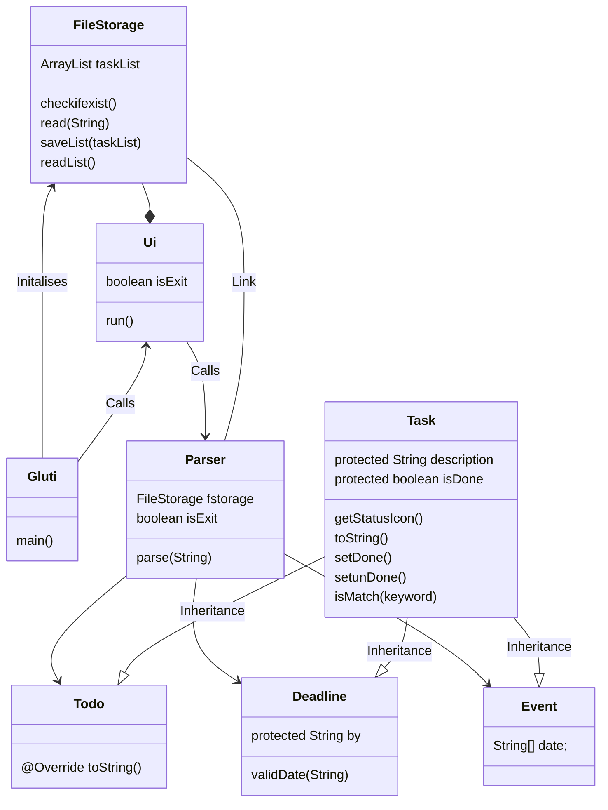

# Gluti project


```

Welcome to the Gluti chatbot!
```

## **Gluti is your chat task manager, it is:**

- Text-based
- User-friendly
- Easy and Fast to use

## Setup

1.  Download the release [here!](https://github.com/garywongkai/ip/releases)
2.  Launch it!
3.  Add your tasks
4.  ~~????~~ Profit

## Features

- [x] Task Manager
- [x] Manages Deadlines!
- [ ] GUI

## UML diagrams



## Setting up in Intellij

Prerequisites: JDK 11, update Intellij to the most recent version.

1. Open Intellij (if you are not in the welcome screen, click `File` > `Close Project` to close the existing project first)

1. Open the project into Intellij as follows:

1. Click `Open`.

1. Select the project directory, and click `OK`.

1. If there are any further prompts, accept the defaults.

1. Configure the project to use **JDK 11** (not other versions) as explained in [here](https://www.jetbrains.com/help/idea/sdk.html#set-up-jdk).<br>

In the same dialog, set the **Project language level** field to the `SDK default` option.

3. After that, locate the `src/main/java/Duke.java` file, right-click it, and choose `Run Duke.main()` (if the code editor is showing compile errors, try restarting the IDE). If the setup is correct, you should see something like the below as the output:

## The code 🔥

```
static void main(String[] args) {
	//Insert amazing Gluti code here!
}
```
