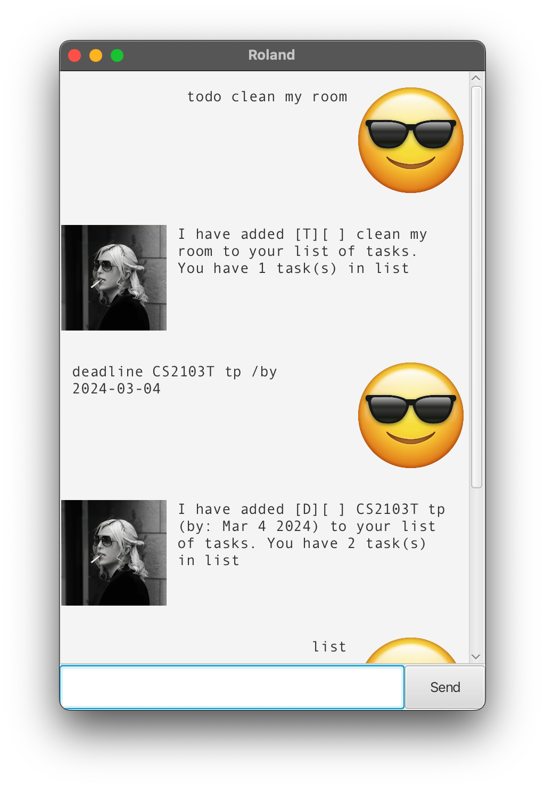

# Slaybot User Guide

## About

Slaybot is a simple chatbot with an intuitive Graphical User Interface (GUI) that helps you track your tasks.

Slaybot is also capable of remembering your added tasks, even when the GUI is closed.


If you're new here, you can start with [Getting Started](#getting-started).

If you have used Slaybot before, you can jump straight to Slaybot's [Features and Commands](#features-and-commands).



**Figure 1**: How Slaybot's GUI appears on the Windows operating system.

## Getting Started

[//]: # ( <h1 style="color:purple;">Hello World</h1>)

1. Ensure you have [Java 11](https://www.oracle.com/sg/java/technologies/javase/jdk11-archive-downloads.html) installed on your Computer by opening up a command terminal and typing `java -version`. The build version is contained in the (brackets).

2. Download the latest  from [here]().

3. Copy the file to the folder you want to use as the home folder for your Slaybot.

4. Open a command terminal.

5. Change the working directory to the folder you put the .jar in, by typing and running `cd {directory}`

6. Then, type and run the `java -jar slaybot-v0.2.jar` command to run the application.

## Features and Commands

---
### `todo` - Add a todo task

To add a todo task to your task list, you can type `todo [TASK_NAME]`

**Example of usage:**

`todo find hope`

**Expected outcome:**

```
Todo Task Added: [T][ ] find hope 
You have _ tasks.
```
---
### `deadline` - Add a deadline task

To add a task with a deadline to your task list, you can type `deadline [TASK_NAME] /by [DD/MM/YYYY HHMM]`


**Example of usage:**

`deadline finish ip /by 21/02/2024 1500`

**Expected outcome:**

```
Deadline Task Added: [D][ ] finish ip by Feb 21 2024
You have _ tasks.
```
---
### `event` - Add an event task

To add an event task with a start and end time to your task list, you can type `event [TASK_NAME] /from [START_DATE_TIME] /to [END_DATE_TIME]`

Please note that the format for both START_DATE_TIME and END_DATE_TIME is 'DD-MM-YYYY hhmm'

**Example of usage:**

`event redrum /from 20/02/2024 0100 /to 21/02/2024 1500`

**Expected outcome:**

```
Event Task Added: [E][ ] redrum (from: Feb 20 2024 to: Feb 21 2024)
You have _ tasks.
```
---
### `list` - View all tasks

To view all the tasks you have added so far, you can type `list`

**Example of usage:**

`list`

**Expected outcome:**

```
Your tasks:
1. [T][ ] find hope
2. [D][ ] finish ip by Feb 21 2024
3. [E][ ] redrum (from: Feb 20 2024 to: Feb 21 2024)
```
---
### `mark` - Mark a task as done

To mark a task as done, you can type `mark [TASK_INDEX]`

**Example of usage:**

`list`, followed by `mark 1`

**Expected outcome:**

```
OK, I've marked this task as done:
[D][X] finish ip by Feb 21 2024
```
---
### `unmark` - "Unmark" a task as not done

To mark a task as not done, you can type `unmark [TASK_INDEX]`

**Example of usage:**

`list`, followed by `unmark 2`

**Expected outcome:**

```
OK, I've marked this task as not done yet:
[D][ ] finish ip by Feb 21 2024
```
---
### `delete` - Delete a task

To delete a task, you can type `delete [TASK_INDEX]`

**Example of usage:**

`list`, followed by `delete 1`

```
Successful deletion
You now have _ tasks
```
---
### `find` - Find a task

To find a task, you can type `find [A_WORD_IN_THE_TASK]`

A_WORD_IN_THE_TASK refers to any word contained within the task, and is not case-sensitive.

**Example of usage:**

`find redrum`

**Expected outcome:**

```
1. [E][ ] redrum (from: Feb 20 2024 to: Feb 21 2024)
```
---
### `bye` - Exit the bot

Going so soon? :(

To exit the bot, you can type `bye`

**Example of usage:**

`bye`

**Expected outcome:**

```
Bye. Hope to see you again soon!
```
