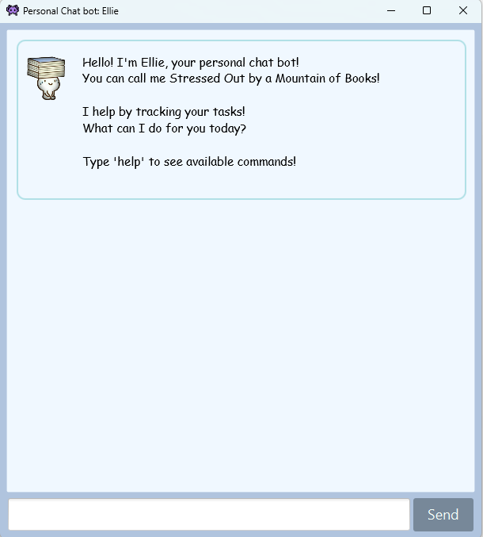

# "Ellie" Personal Assistant Chatbot

## Description

Welcome to the Chatbot Project! This project aims to develop a chatbot using Java and JavaFX. 
The chatbot is designed to assist users with various tasks, such as task management, scheduling, 
and providing information.

<div style="text-align:center;">
    
</div>

<div align="center">
  <text> Snapshot of Ellie in Action! </text>
  <p> </p>
</div>

## Features

- Task management: Add, delete, mark/unmark tasks.
- Support for different task types: Todo, Deadline, Event.
- Interactive graphic user interface (GUI).
- Error handling for invalid commands or inputs.
- User-friendly help command to view supported commands.

## Technologies Used

- Java, JavaFX
- Git

## Getting Started

To get started with the chatbot, follow these steps:

1. Download `Java 11`.
   * For Windows, download from [here](https://www.oracle.com/java/technologies/javase-jdk11-downloads.html).
   * For MacOS, follow this guide [here](https://docs.oracle.com/en/java/javase/11/install/installation-jdk-macos.html#GUID-2FE451B0-9572-4E38-A1A5-568B77B146DE).
1. Download the latest `Ellie-<version>.jar` from [here](https://github.com/gerteck/ip/releases).
1. After downloading, navigate to your 'Downloads' folder:
   * Create a folder to put the file in.
   * Navigate to that folder. Right click in the folder, and select `Open in Terminal` or `Open in Command Prompt`.
   * Run the command `java -jar Ellie-<version>.jar` to start Ellie. Replace `<version>` with the version number of the file you downloaded.

<div style="text-align:center;">
    
</div>

<div align="center">
  <text> Snapshot of Ellie upon opening .jar file! </text>
  <p> </p>
</div>

## Usage

Once the chatbot is running, you can interact with it by typing commands into the command-line interface. Use the `help` command to view the list of supported commands and their usage.

Here are some example commands:

- `todo Buy groceries`
- `deadline Submit report /by 2024-02-29`
- `event Team meeting /from 2024-02-28 /to 2024-02-29`
- `list`
- `mark 1`
- `delete 2`

## Contributing

Contributions are welcome! If you have any ideas for new features, improvements, or bug fixes, feel free to open an issue or submit a pull request.


## Duke project template

This project is based off the project template for a greenfield Java project, 
named Duke, after the Java mascot _Duke_. 
   ```
   Hello from
    ____        _        
   |  _ \ _   _| | _____ 
   | | | | | | | |/ / _ \
   | |_| | |_| |   <  __/
   |____/ \__,_|_|\_\___|
   ```
