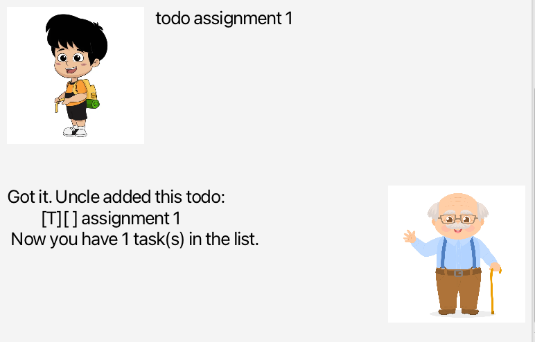
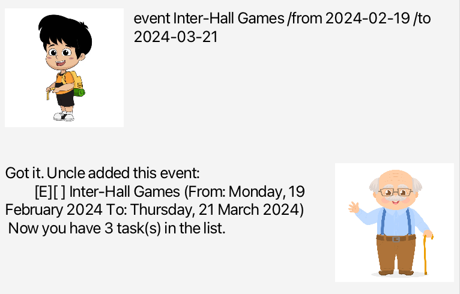
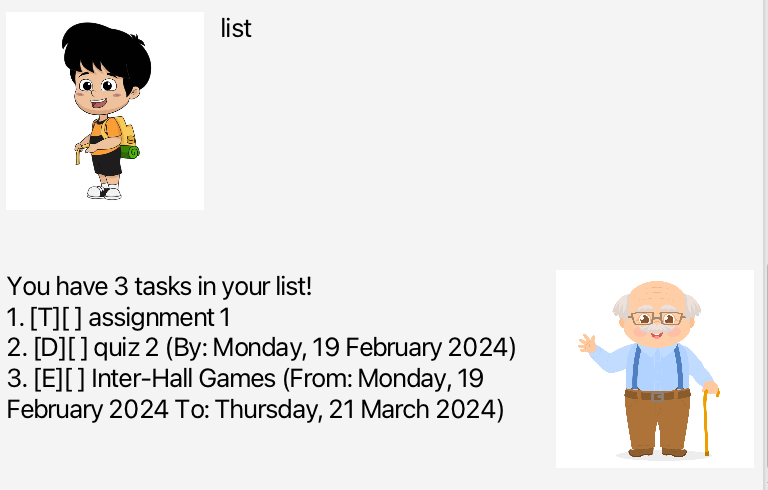
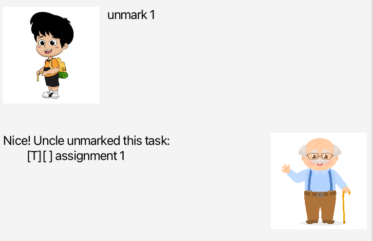
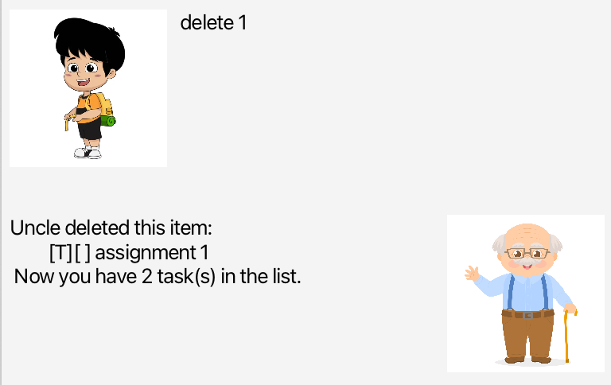
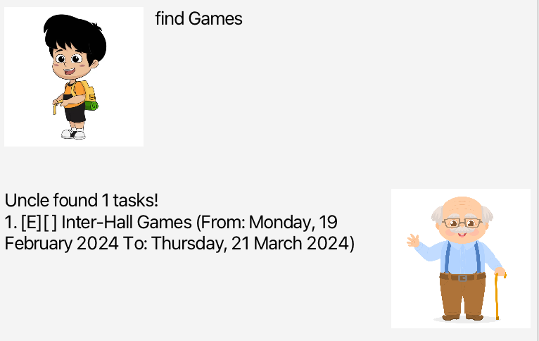
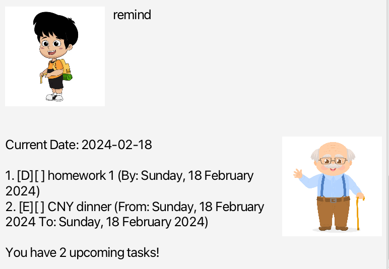

# UncleBob User Guide

***

Uncle Bob is a Java CLI application which enables a user to include tasks, enabling the user to mark tasks, set dates for deadlines and events and also remind the user of daily upcoming tasks.
***

## Adding Todos: `todo`
Adds a todo to the task list.

Format: `todo DESCRIPTION`
Example: `todo assignment 1`

## Adding Deadlines: `deadline`
Adds a deadline to the task list, specifying a date the task should be completed by.

Format: `deadline DESCRIPTION /by DATE`

Example: `deadline quiz 2 /by 2024-02-19`

## Adding Events: `event`
Adds an event to the task list. Specifying the start and end date.

Format: `event DESCRIPTION /from DATE /to DATE`

Example: `event Inter-Hall Games /from 2024-02-19 /to 2024-03-21`

## Listing All Tasks: `list`
Lists all tasks.

Format: `list`

## Marking Completed Tasks: `mark`
Marks a task as done.

Format: `mark INDEX`

Example: `mark 1`

## Unmarking Completed Tasks: `mark`
Unmark a task.

Format: `unmark INDEX`

Example: `unmark 1`

## Deleting Tasks: `delete`
Delete a task.

Format: `delete INDEX`

Example: `delete 1`

## Finding Tasks: `find`
Find all tasks containing the specified keyword.

Format: `find KEYWORD`

Example: `find Games`

## Getting Reminders: `remind`
Reminds the user of all tasks occurring on the day.

Format: `remind`

## Saving the data
UncleBob data is saved in the hard disk automatically after any command that changes the data. There is no need to save manually.

## Editing the data file
UncleBob data is saved automatically as a txt file `[JAR file location]/data/unclebob.txt`. Advanced users are welcome to update data directly by editing that data file.

## Command Summary
|       Action       | Format                                  |
|:------------------:|-----------------------------------------|
|    **Add Todo**    | `todo DESCRIPTION`                      |
|  **Add Deadline**  | `deadline DESCRIPTION /by DATE`         |
|   **Add Event**    | `event DESCRIPTION /from DATE /to DATE` |
|   **List Tasks**   | `list`                                  |
|   **Mark Task**    | `mark INDEX`                            |
|  **Unmark Task**   | `unmark INDEX`                          |
|  **Delete Task**   | `delete INDEX`                          |
|   **Find Task**    | `find KEYWORD`                          |
| **Get Reminders**  | `remind`                                |
