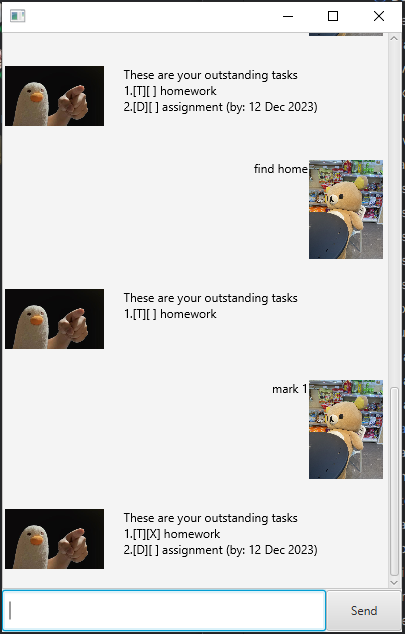

# Duc - Personal Task Management Assistant User Guide

Welcome to Duc, your personal task management assistant. This guide will help you navigate through Duc's features and functions to enhance your productivity.

## Getting Started

### Prerequisites

- Ensure you have Java 11 installed on your system. If not, download and install it from [Oracle's official website](https://www.oracle.com/java/technologies/javase-jdk11-downloads.html).

### Installation

1. Download the `Duc.jar` file from the provided link.
2. Open your command line interface (CLI).
3. Navigate to the directory where the `Duc.jar` file is located.
4. Run the application using the command: java -jar duc.jar

## Features

### 1. Adding Tasks

Duc supports three types of tasks:

- **Todo**: A basic task with a description.
  - Command: `todo [task description]`
- **Deadline**: A task with a due date.
  - Command: `deadline [task description] /by [YYYY-MM-DD]`
- **Event**: A task that occurs over a period.
  - Command: `event [event description] /from [start date YYYY-MM-DD] /to [end date YYYY-MM-DD]`

### 2. Viewing All Tasks

- View a list of all your tasks.
  - Command: `list`

### 3. Marking Tasks as Done

- Mark a task as completed.
  - Command: `mark [task number]`

### 4. Unmarking Tasks

- Revert a task to an uncompleted state.
  - Command: `unmark [task number]`

### 5. Deleting Tasks

- Remove a task from your list.
  - Command: `delete [task number]`

### 6. Finding Tasks

- Find tasks by a keyword.
  - Command: `find [keyword]`

### 7. Exiting Duc

- Safely close the application.
  - Command: `bye`

## Error Handling

- If you enter a command in an incorrect format, Duc will provide an error message guiding you to use the correct format.

## Data Storage

- Your tasks are automatically saved after each operation, ensuring that your data is not lost even if the application closes unexpectedly.

## Support

For additional support or feedback, please contact the Duc support team.

Thank you for using Duc - your reliable task management assistant!
