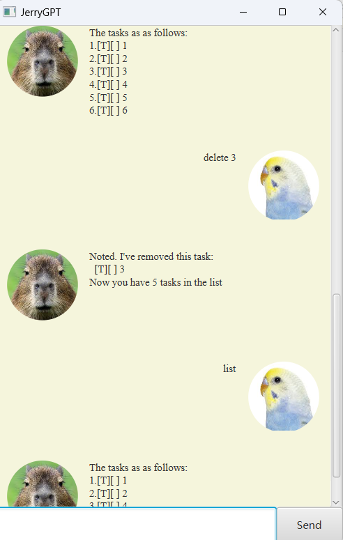

# Atlas User Guide

Atlas is a **chatbot for managing tasks, optimized for use via a Command 
Line Interface** (CLI). If u can type fast, Atlas can get help you manage
your tasks much faster.

## Adding todos: `todo`
Adds a todo to the list with a priority ranging from 0 to 5.
If no priority is specified, a default value of 3 is given.

Format: `todo <task> [/priority <value>]`

Example:

- `todo return book`
-  `todo return pencil /priority 5`

## Adding deadlines: `deadline`

Adds a deadline to the list with a priority ranging from 0 to 5.
If no priority is specified, a default value of 3 is given. **An end date
and time must be specified in the format of YYYY-MM-DD HHmm**

Format: `deadline <task> /by <YYYY-MM-DD HHmm> [/priority <value>]`

Example: 

- `deadline homework /by 2024-02-02 1500`
- `deadline assignment /by 2024-05-30 0000 /priority 1`

## Adding events: `event`

Adds an event to the list with a priority ranging from 0 to 5.
If no priority is specified, a default value of 3 is given. **A start date
and time must be specified in the format of YYYY-MM-DD HHmm. An end date and time
must also be specified in the same format**

Format: `event holiday /from <YYYY-MM-DD HHmm> /to <YYYY-MM-DD HHmm> [/priority <value>] `

Example:

- `event new year /from 2024-02-02 1500 /to 2024-03-02 1500 /priority 2`
- `event carnival /from 2024-05-05 1500 /to 2024-06-06 1500`

## Delete task: `delete`

Deletes a task from the list by specifying the index.

Format: `delete <task index>`

- The index must refer to an index number shown in the displayed task list.

Example: 

- `delete 1` deletes the first task in the list.

## Listing tasks: `list`

Lists all the tasks.

Format: `list`

## Marking tasks: "mark"

Marks a task as completed or unmark it.

Format: `mark <task index>`

- The index must refer to an index number shown in the displayed task list.
- If a task is unmarked initially, after the command, the task would be marked.
- If a task is marked initially, after the command, the task would be unmarked.

Example:

- `mark 3` would mark task 3

## List tasks on a specific day: `tasks_on`

Shows all the events and deadlines that fall on that day. **Events would be displayed
as long as given date falls in between the start and end date, inclusive.**

Format: `tasks_on <YYYY-MM-DD>`

Example:

- `tasks_on 2024-02-02` would show all the events and deadlines on that day.

## Finding task with keyword: `find`

Find tasks with a specific keyword.

Format: `find <keyword>`

Example:

- `find home` would return a task that has "home" as substring of its description.

## Change task priority: `change_priority`

Changes the priority of an existing task.

Format: `change_priority <task index> <new priority>`

- Task index needs to refer to an existing task in the list.
- New priority value should be in the range of 0 to 5.

Example:

- `change_priority 5 0` would set task of index 5 to priority 0.

## Exiting the program: `bye`

Exits the program

Format: `bye`

## Saving the data

Atlas automatically save the data in the hard disk automatically after every command.
There is no need to save manually.