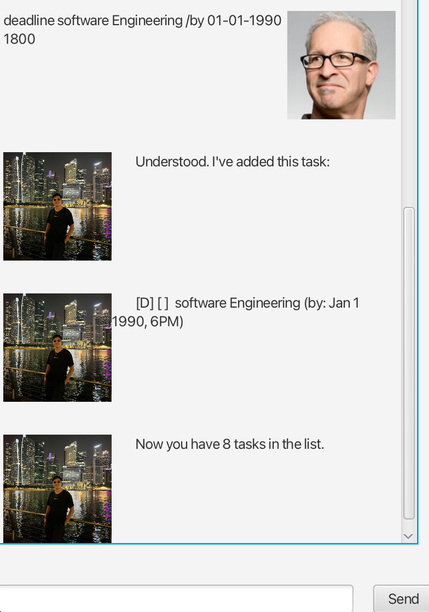
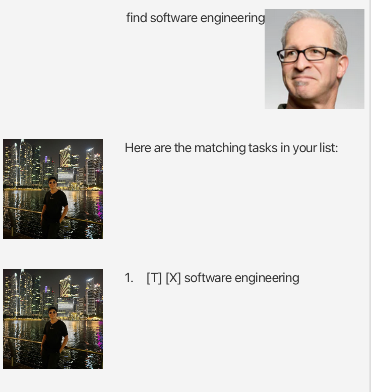
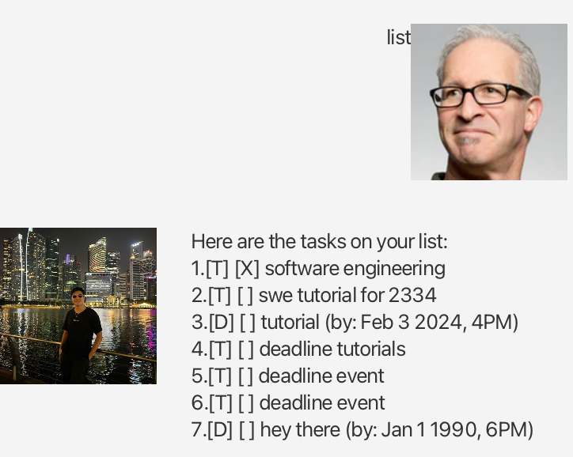
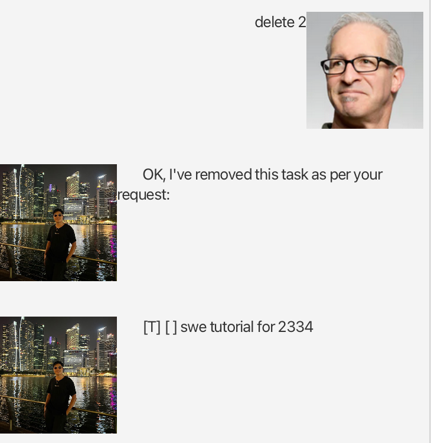
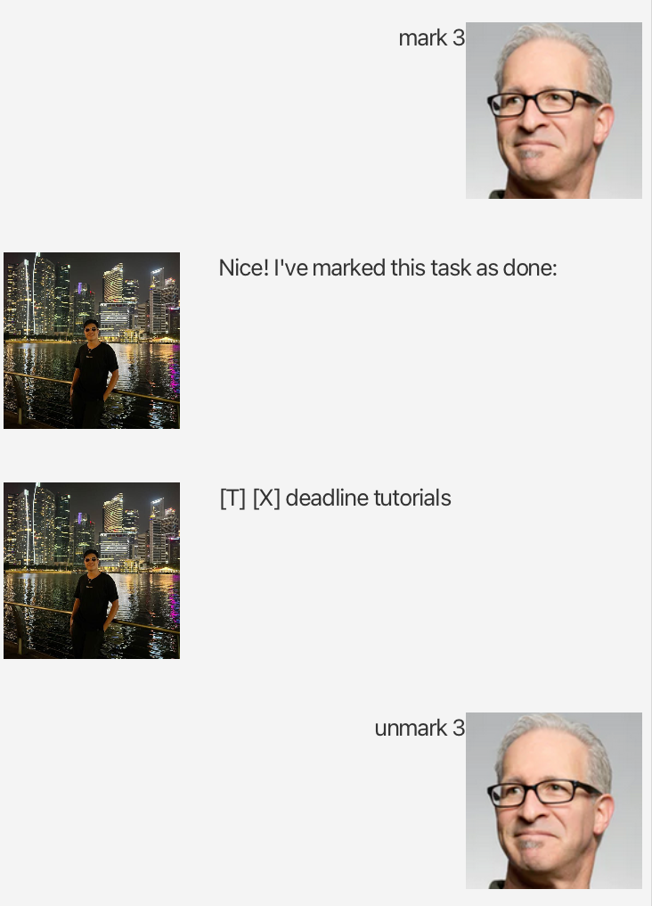

# Kervyn User Guide


**Ever wanted a tool to keep track of your tasks for you?**

**Tired of missing deadlines and forgetting important events?**

### Welcome to Kervyn Chatbot, the solution to YOUR problems.

## Features
1. Add tasks depending on their type. On release, we offer **Todos**, **Events** and **Deadlines**
2. Search for tasks using our accurately implemented **find** feature
3. Get the Chatbot to **list** down your tasks, so you can keep stock of all that's on your agenda!

... and much more!

## 1. Adding ToDos, Deadlines and Events
Use the below command samples to add tasks to your Chatbot!
```
todo Software Engineering
```

```
deadline Software Engineering /by 01-01-1990 1800
```

```
event Software Engineering /from 01-01-1990 1800 /to 01-01-1990 1830
```

**Expected Output**



## 2. Finding tasks
Only remember your tasks by their keywords? Don't fret! Try our **find** command below
```
find software engineering
```

**Expected Output**



## 3. List tasks
Keep a stock take of all your current tasks using this command

```
list
```

**Expected Output**



## 4. Delete Tasks
Delete a task that you created by it's position in the list
```
delete 2
```

**Expected Output**



## 5. Mark/unMark tasks
Mark a task as completed, and undo that by using the unmark command
```
mark 3
unmark 3
```

**Expected Output**



## 6. Saving your progress/ending the conversation (IMPORTANT)
When you're done with the chatbot, remember to be friendly and let it know you are done! Say Bye!
**NOTE: This step is crucial as it ensures your data that you added/saved/marked/unmarked is saved**
```
bye
```