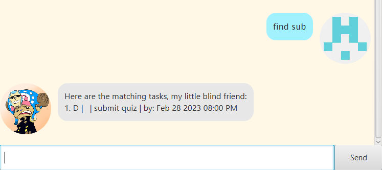

# Tes


Tes is a chatbot which helps you to **record tasks** which is **optimized for use via a Command Line Interface (CLI)** while still having the benefits of a Graphical User Interface (GUI). Tes can sometime be aggrssive and sarcastic, but still, he is a good helper and reminder who is always at your service!  

## Features
> [!NOTE]
> - Words in ```UPPER_CASE``` are the parameters to be supplied by the user.
> - If the parameter involves ```DATE_AND_TIME```, it means to have both date and time specified in the format of ```yyyy-mm-dd hhmm```
> - If the parameter involves ```INDEX```, the index refers to the index number shown in the displayed task list after typing command ```list```. The index **must be a positive integer** 1, 2, 3, …​ and should not exceed the total number of tasks stored in the list. The command will be applied to the task at this specified index in the task list.
>
>   e.g. ```2024-02-27 1900```

### Viewing help: ```help```
Shows a new window with a summary table of all commands available.


### Adding a todo task: ```todo```
Add a todo task to the list.

Format: ```todo TASK```

Example: ```todo laundry```  

### Adding a deadline task: ```deadline```
Add a task with a deadline to the list.

Format: ```deadline TASK /by DATE_AND_TIME```

Example: ```deadline quiz submission /by 2024-02-27 0000```  

### Adding an event: ```event```
Add an event to the list.

Format: ```event TASK /from DATE_AND_TIME /to DATE_AND_TIME```

Example: ```event prom night /from 2024-04-29 1900 /to 2024-04-29 2300```    
    
### Listing the stored tasks: ```list```
List all the previously stored tasks.

Format: ```list```

### Marking a task: ```mark```
Mark an existing task in the list as done.

Format: ```mark INDEX```

Example: ```mark 1```

### Unmarking a task: ```mark```
Unmark an existing task in the list as not done.

Format: ```unmark INDEX```

Example: ```unmark 1```

### Deleting a stored task: ```delete```
Delete an existing task in the list.

Format: ```delete INDEX```

Example: ```delete 1```

### Finding a task: ```find```
Find tasks which contains a keyword in its task description.

Format: ```find KEYWORD```

> [!TIP]
> - The ```KEYWORD``` need not be a completed word, any task with a task description that contains this ```KEYWORD``` will be listed.

Example: ```find sub```



### Exiting the chatbot: ```bye```
Close the application and exit the chatbot.

Format: ```bye```

### Saving the data
New data are saved in the hard disk automatically after any command that changes the data. There is no need to save manually.
