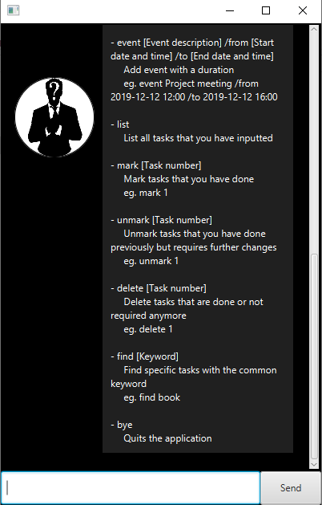

# Unknown User Guide

Unknown allows you to track your task to keep you on track.

## Quick Start

1. Download `Unknown.jar` from [here](https://github.com/nobodyishappy/ip/releases/download/A-UserGuide/Unknown.jar).
2. Drag it to a location that you want to save your tasks.
3. Double click it to run.
4. Type `help` to get the commands of the application.

## Viewing help: `help`

Shows the commands for the application

## Adding todos: `todo`

Add task that you want to do without deadline

Format: `todo [Todo description]`

eg. `todo Read book`

## Adding deadlines: `deadline`

Add task that you want to do with deadline

Date and time in `YYYY-MM-DD HH:MM` format.

Format: `deadline [Deadline description] /by [Date and Time]`

eg. `deadline Return book /by 2019-12-12 12:00`

## Adding events: `event`

Add event with a duration

Date and time in `YYYY-MM-DD HH:MM` format.

Format: `event [Event description] /from [Start date and time] /to [End date and time]`

eg. `event Project meeting /from 2019-12-12 12:00 /to 2019-12-12 16:00`

## Listing tasks: `task`

List all tasks that you have inputted

Format: `list`

## Marking tasks: `mark`

Mark tasks that you have done

Format: `mark [Task number]`

eg. `mark 1`

## Unmarking tasks: `unmark`

Unmark tasks that you have done previously but requires further changes

Format: `unmark [Task number]`

eg. `unmark 1`

## Deleting tasks: `delete`

Delete tasks that are done or not required anymore

Format: `delete [Task number]`

eg. `delete 1`

## Finding tasks: `find`

Find specific tasks with the common keyword

Format: `find [Keyword]`

eg. `find book`

## Quitting program: `bye`

Quits the application

Format: `bye`

