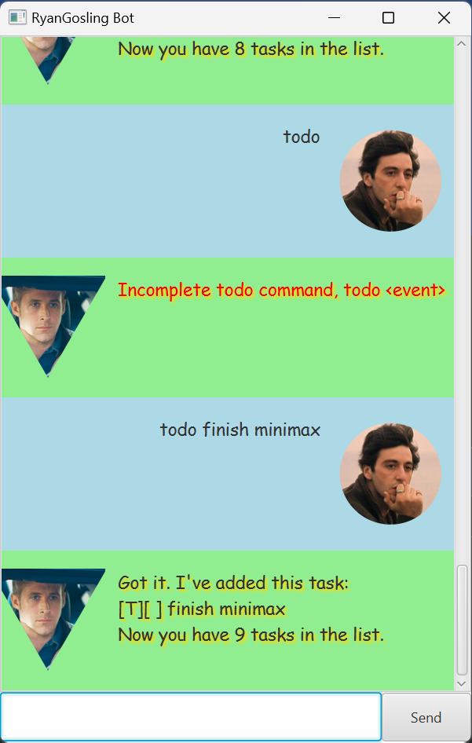
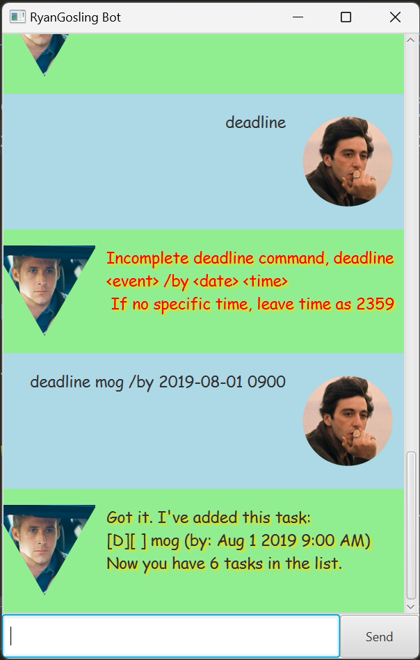
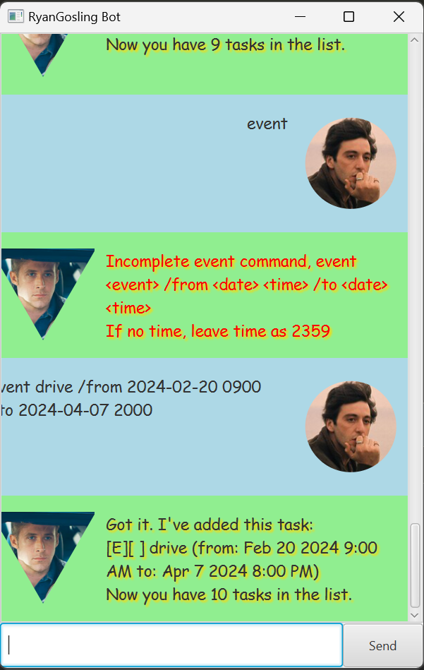
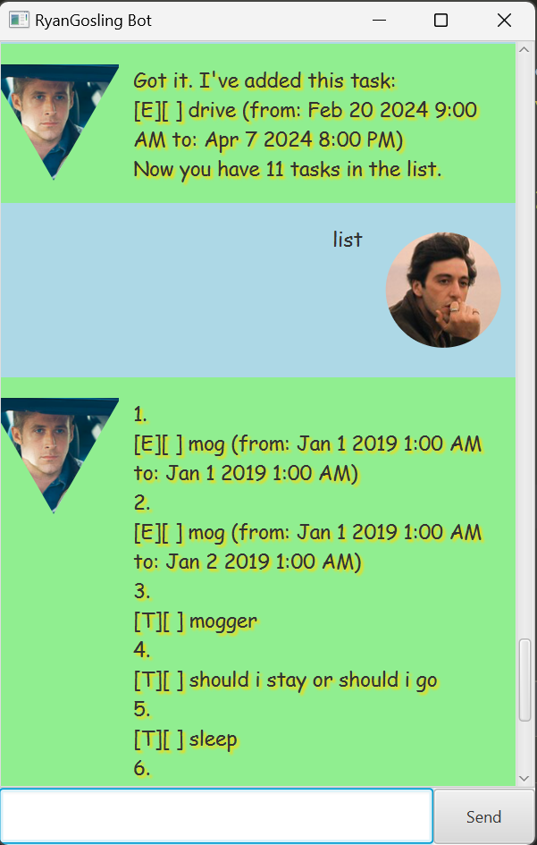
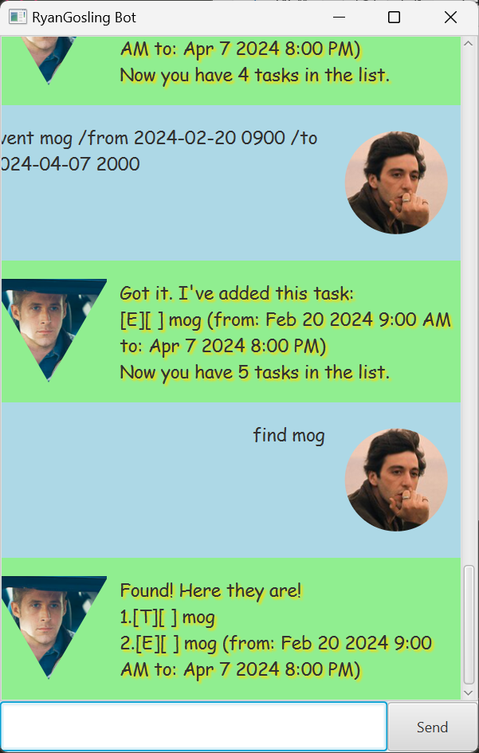
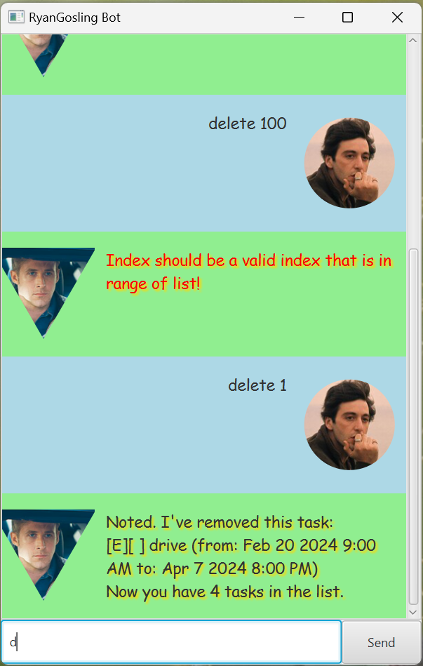

# Ryan Gosling Bot User Guide 🚗


Whether you're on a quest for productivity or just trying to avoid doing the laundry, Ryan Gosling is at your service!.
Type away your tasks, and let's turn your to-do list into a to-done list! 💪📋

## Adding Todo 📝



User is able to type in a single line todo command and add a todo task.
Format is ```todo <eventName>```

Example: ```todo survive ```

RyanGosling bot replies
if the todo task is added successful with a summary of the task added and the size of the current to-do list!


## Adding Deadlines ⏰



User is able to type in a single line deadline command and add a deadline task.
Format is ```deadline <eventName> /by <date in YYYY-MM-DD> <time in 24HR>```

Example: ```deadline finish iP /by 2024-02-23 2359 ```

RyanGosling bot replies
if the deadline task is added successful with a summary of the task added and the size of the current to-do list!

## Adding Event 🎉



User is able to type in a single line event command and add an event task.
Format is ```event <eventName> /from <date_first in YYYY-MM-DD> <time_first in 24HR> /to <date_second in YYYY-MM-DD> <time_second in 24HR>```

Example: ```event drive /from 2024-02-20 0900 /to 2024-04-07 2000```

RyanGosling bot replies
if the event task is added successful with a summary of the task added and the size of the current to-do list!

## View the List of Tasks 📄



User is able to view the list of tasks with single `list` command.
Format is ```list```

RyanGosling bot replies with the list of tasks.

## Find a Task in the List of Tasks 🔍



User is able to type in a single line find command and view all tasks containing that query.
Format is ```find <eventName>```

Example: ```find drive```

RyanGosling bot replies with a list of tasks containing that task string.

## Delete a Task ❌



User is able to type in a single line delete command and delete a task with that index.
Users must ensure the index is a valid number and within range of the list.

Format is ```delete <index>```

Example: ```delete 2```

RyanGosling bot replies with the task that has been deleted and updates user with new list size!

### Special shoutout to the teaching team and those who helped out in the forum or through other means!


