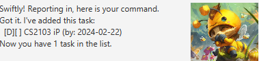
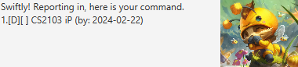

# <i>Teemo</i> User Guide

Teemo, your personal chatbot!

## Adding deadlines

Ability to add tasks for Teemo to help you track them.

Syntax: `deadline {task name} /by {date}`

Example: `deadline CS2103 iP /by 2024-02-22`

You now can type `list` to see your tasks.

## Other Features
1. Different types of tasks
   - To do
   - Deadline
   - Event
2. List
3. Mark/Unmark tasks
4. Add/Remove/Update tasks
5. And more! Type `help` to see in more detail.