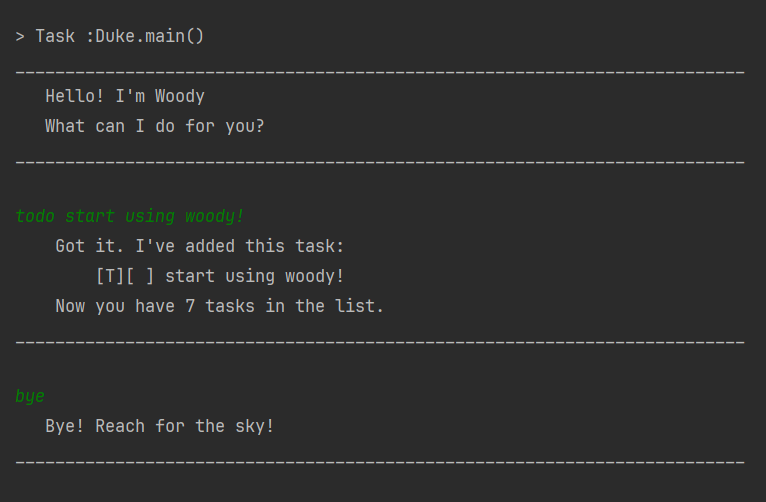

# Woody User Guide



Woody frees your mind of having to remember things you need to do. It helps you
track tasks such as events, deadlines and todos - All in one place!

## Adding deadlines

What if you want a reminder to start using Woody? Add a deadline!

For example: `deadline start using woody /by 11-11-2024`

This will produce the following printout to confirm that the task is successfully added

```
    Got it. I've added this task:
        [D][ ] start using woody (by: Nov 11 2024)
    Now you have 8 tasks in the list.
_________________________________________________________________________
```

## Feature ABC

// Feature details


## Feature XYZ

// Feature details