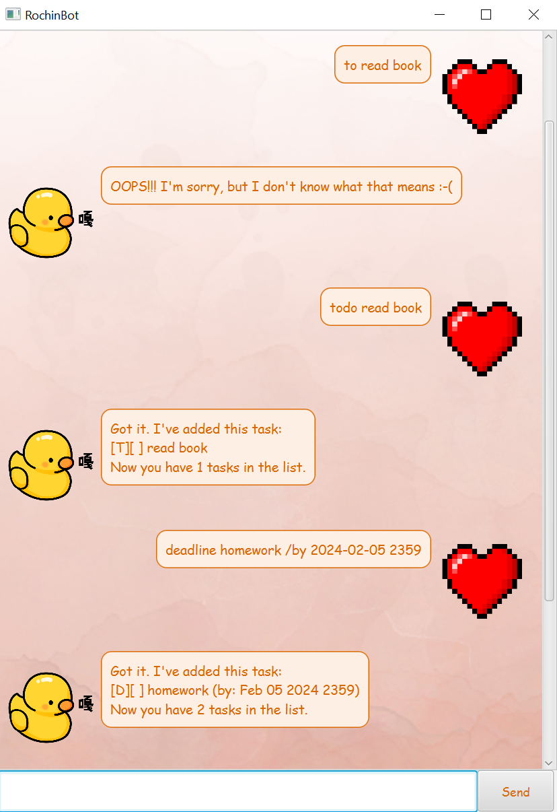

<h1>Plato User Guide  </h1>

---



Plato is a desktop application for managing your everyday task, optimised with CLI-like(Command Line Interface) inputs, it
delivers a beautiful smart personal assistant to interact with.


# Table of Contents
1. [Features](#features)
    1. [Add Task](#add-task)
        * [Todo](#todo)
        * [Deadline](#deadline)
        * [Event](#event)
        * [Specification for DateTimeFormat](#specification-for-datetimeformat)
    2. [Manage Task](#manage-task)
    3. [Query Task](#query-task)
        * [Find](#find)
        * [View](#view)
2. [Save Information](#saving-the-data)
3. [Extra information](#credits)

---
# Features


## Add Task

Adds a task to the current task list 
There are three types of task you can add, todo, deadline and event

### Todo

The todo task just contains a description of the task
Usage: `todo [DESCRIPTION]`

Examples:

* `todo Cook Dinner`

* `todo Read Book`

Expected outcome:
```
Got it. I've added this task:
  [T][ ] Cook Dinner
Now you got 1 tasks in your list.
```

### Deadline

The deadline task is a a todo task with a date to complete by.

Usage: `deadline [DESCRIPTION] /by [DateTimeFormat]` 

<sub>**Refer to the section below for the specification of [DateTimeFormat]**</sub>

Examples:

* `deadline cs3230 /by 2359 23/02/2024`

* `deadline cs2103 /by 23:59 23-02-24`

Expected outcome:
```
Got it. I've added this task:
    [D][ ] cs3230 (by:23-02-2024 23:59)
Now you got 2 tasks in your list.
```

### Event

The event task is a todo task that spans a period of time.

Usage:
`event [DESCRIPTION] /from [DateTimeFormat] /to [DateTimeFormat]`

<sub>**Refer to the section below for the specification of [DateTimeFormat]**</sub>

Examples:

* `event cs2103 planning /from 1800 24/02/24 /to 1900 27/02/24`

* `event midterm study session /from 01:00pm 28-02-24 /to 02:00pm 30-02-24`

Expected outcome:
```
Got it. I've added this task:
    [E][ ] cs2103 planning (from:23-02-2024 18:00)
Now you got 3 tasks in your list.
```
### Specification for `[DateTimeFormat]`

It comes in two parts `[DateFormats]` and `[TimeFormats]`.
`[TimeFormats]` can be omitted and Plato will assume the time to be midnight of that particular day.

The order of the `[DateFormats]` and `[TimeFormats]` does not matter as long as a space between them to differentiate the two

> If your [DateTimeFormat] is invalid, Plato will store them as normal strings instead ,this is to support a wider variety fo users,
> this will affect the Query:view command later

Usage:
```
[DateFormats]
[DateFormats] [TimeFormats]
[TimeFormats] [DateFormats]
```

Examples :
```
12-04-24 1800
03:30pm 15/03/2024

```

Current acceptable **[DateFormats]** are :
```
dd-mm-yy
dd/mm/yy
dd-mm-yyyy
dd/mm/yyyy
```

> [!NOTE]
> If the year used is 2 digits, Plato will assume the year in the current millennium

Current acceptable **[TimeFormats]** in 12 or 24 hour formats are allowed as follows:
```
HHMM
HH:MM
HH:MM[am/pm]
```
> [!CAUTION]
> Time written in 12-hour format requires specifying am/pm. Otherwise, Plato will assume 24-hour format.


---

## Manage Task
You can modify existing task with unmark, mark, delete at the particular index.
Usages:
```
umark [INDEX]
mark [INDEX]
delete [INDEX]

```

Examples:
```
mark 1
delete 3
```

Expected outcome:
```
Nice! I've marked this task as done:
    [T][X] Cook dinner
    
Noted. I've removed this task
 [E][ ] cs2103 planning (from:23-02-2024 18:00)
 Now you have 2 taks in the list

```
---

## Query Task

When you know specific information about task and you wish to find a specific task by their attributes.

### Find

Finds in the description of each task if it matches the keyword 

Usage: `find [KEYWORD]`

### View

View the all the task being scheduled on that date.

Usage: `view [DateFormats]`

<sub>**Refer to the section above for the specification of [DateFormat]**</sub>

> If your [DateTimeFormat] is invalid when adding the task, Plato will not show them in the results when you try to search for it.

Examples:
```
find Cook
view 23-02-24
```

Expected outcome:
```
Here are the matching task in your list:
   1. [T][X] Cook dinner
    
Here are the task scheduled on that date: 
 1. [E][ ] cs2103 planning (from:23-02-2024 18:00)
 ```

---

# Saving the data

Plato's data are saved in the hard disk automatically at an fixed interval. There is no need to save manually.

---

# Editing the data file

Plato's data are saved automatically as a .txt file `[JAR file location]/data/tasks.txt`. Advanced users are welcome to update or import their own data.


> [!WARNING]
> If your file changes to data file is of an invalid format. Plato will flush out the old data and start afresh. 

# Credits
All images used are artworks of my own!

