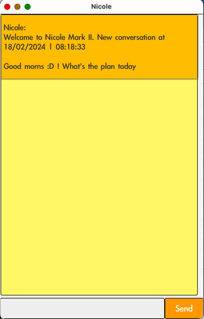
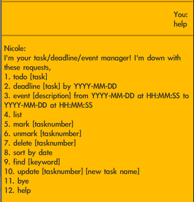
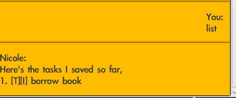
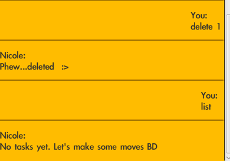
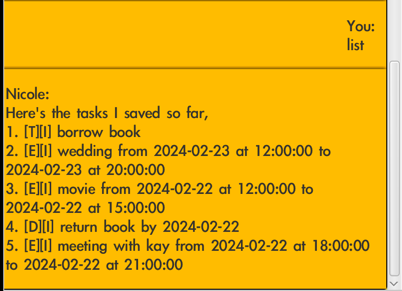
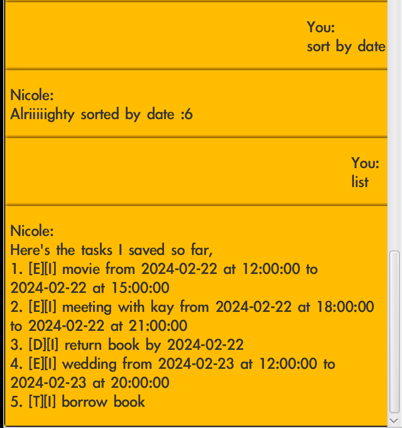

# Nicole [Mark 0.2] User Guide

Nicole is your smart task, deadline
and event manager! Give her commands using the formats
specified in this guide and 
look forward to easier days ahead :D

## Setting up

Skip to the basic guide if you need a little more help :hearts:

### Intermediate Guide
1. Ensure the version you are currently running is `Java 11` and switch if necessary.
   - Switching for [Windows](https://stackoverflow.com/questions/26993101/switching-between-different-jdk-versions-in-windows)
   - Switching for [Mac](https://stackoverflow.com/questions/21964709/how-to-set-or-change-the-default-java-jdk-version-on-macos)
2. Follow from Step 2 of the Basic Guide!
   - :speaker: MacOS users, you may need to download a specific version of `Java` if you encounter issues
     launching Nicole. Simply follow from Step 1 of the Basic Guide in this scenario.

### Basic Guide

1. Download `Java 11`
   - For [Windows](https://arc.net/l/quote/xrxbvatl)
   - For MacOS (navigate to the "About This Mac" menu to find out which chip your mac has installed): 
     - [M1](https://arc.net/l/quote/rqjezudg)
     - [Intel](https://arc.net/l/quote/luolepqe)
2. Once you've downloaded `Java`, download the `Nicole.jar` file from [here](https://github.com/yashpola/ip/releases/tag/Level-10)
3. Navigate to your `downloads` directory and
   - Create a folder to put the `jar` file in
   - Double-click the `jar` file to launch Nicole. A window like the one shown below should open
   - Fire away!

Take note that when using Nicole, a `tasks.txt` file will
appear in your computer. This file will simply 
be used to save your items between sessions.

## Getting started

To know what basic commands Nicole can help you with, 
simply type-in `help` and you should see 
something like this:

Take note that when typing the actual commands, 
you should omit any square braces ([ ]) pictured above. 

You can find other helpful pointers below for a few of Nicole's commands.
Pay closer attention to the points marked with :writing_hand:!

## Adding an item

After adding an item in the following formats: 
1. `todo [task]`
2. `deadline [task] by YYYY-MM-DD`
3. `event [description] from YYYY-MM-DD at HH:MM:SS to YYYY-MM-DD at HH:MM:SS`

The item will appear in a `tasks.txt` file respectively in the following
formats: 
1. `[T][I] [task]`
2. `[D][I] [task] by YYYY-MM-DD`
3. `[E][I] [description] from YYYY-MM-DD at HH:MM:SS to YYYY-MM-DD at HH:MM:SS`

where `T, D, E` stand for `Todo`, `Deadline`, `Event` respectively
and `I` is the default status of the item
which is `Incomplete`.

## Marking, Unmarking, Deleting, and Updating items

Ensure you enter the correct item number for the item 
you are trying to `mark`, `unmark`, `delete` or `update`.
You can always ask Nicole to `list` 
first to check the items and their 
tasknumbers.

For example, if you wish to delete a `todo`, you
could `list`:

and then accordingly `delete 1` to see a confirmation:

In this particular case since `borrow book` was the only
item, no items remained after deleting it.

:writing_hand: If you `mark` an item, its `I` status will change to `C` (meaning `Complete`). Vice versa for `unmark`.

## Adding Deadlines and Events

Take note!
- The specified formats of `by YYYY:MM:DD` for deadlines 
and `from YYYY:MM:DD at HH:MM:SS to YYYY:MM:DD at HH:MM:SS`
for events are strict! 

Potential triggers for errors :warning:
- For events specifically:
  - Adding events that overlap one another in any way
  - Specifying a `to...at` datetime that precedes the
    `from...at` datetime. For example, `event meeting from 2024-02-21 at 18:00:00 to 2024-02-21 at 15:00:00`)
- For both events and deadlines: 
  - Specifying date(times) that precede the current date(time). For example, `event meeting from 2010-01-01...`

Nicole will indicate to you very clearly if you made 
any of the above errors and also guide you 
on how to rectify your command, so fret not!

:writing_hand: Updating an event could also lead to 
problems with clashing events. When in doubt, `list` to 
peruse your current items first.

## Sorting

`sort by date` will rearrange your list
of items from earliest to latest as per their date(time) like so:

where events are sorted per their  `from` datetime. If an event's 
`from` date matches the date of a deadline, the event will
take precedence (such as items 2 and 3 above).

:writing_hand: Since `todos` do not have a datetime, they are ordered
**last** by default.

## Finally...
Remember to ***have fun*** with Nicole!
She will help you as much as possible in error and save your
item history for ease of repeated use. 