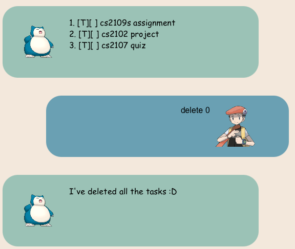

# ALLY User Guide

Introducing ALLY. Your personal Task Tracking assistant. 

## Features

1. **Starting Ally**: Launch the application from your terminal or command prompt.
2. **Adding Tasks**: Use commands to add tasks. Supported task types include *todos*, *deadlines*, and *events*.
3. **Viewing Tasks**: Easily view all your tasks or filter them based on specific criteria.
4. **Updating Tasks**: Mark tasks as done or unmark them with simple commands.
5. **Removing Tasks**: No longer need a task? Delete it with a single command.
6. **Searching Tasks**: Search for task based on specific keywords(s).

Example: `todo finish cs2103T iP`

"Finish cs2103T iP" is now added into the task list. 

## all ALLY Commands
- `BYE`: Exits the application. Your tasks are automatically saved.
- `YAP`: Lists all your tasks.
- `MARK <task_number>`: Marks a task as done.
- `UNMARK <task_number>`: Reverts a task to not done.
- `ADD_TODO <task_description>`: Adds a new todo task.
- `ADD_DEADLINE <task_description> /by <date: yyyy-mm-dd>`: Adds a new deadline task.
- `ADD_EVENT <task_description> /from <date: yyyy-mm-dd> /to <date: yyyy-mm-dd>`: Adds a new event task.
- `DELETE <task_number>`: Deletes a specified task.
- `FIND <keyword>`: Finds tasks containing the specified keyword.
- ` <date: yyyy-mm-dd>`: Lists events and deadlines occurring on a specified date.

Feel free to contact [@4llysa](https://github.com/4llysa) for any enquiries, bug reports or suggestions for improvements.