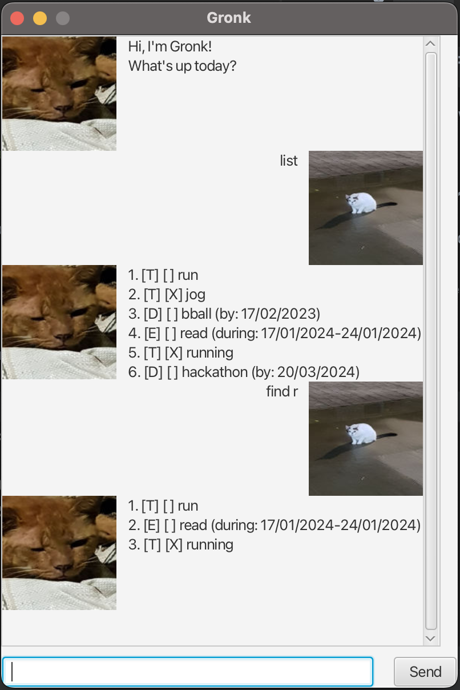
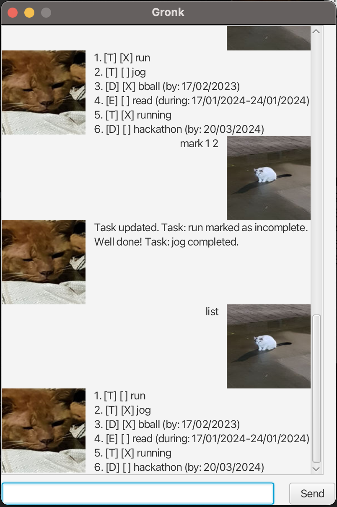
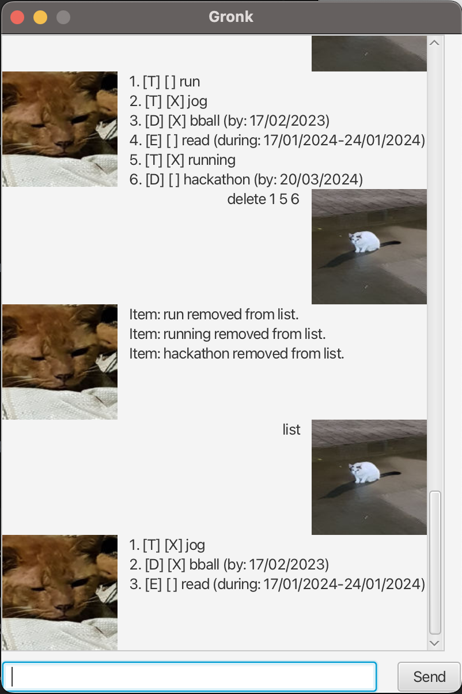

# Gronk User Guide

Welcome to Gronk! A simple app to keep track of your various deadlines and todos.

## Finding help: `help`
Type `help` to get a help page.

## Exiting the program: `bye`
Type `bye` to exit Gronk.

## Listing all tasks: `list`
Type `list` to see all tasks currently stored.

## Adding new tasks
Gronk provides the user with three different `Task` types: `Todo`s, `Deadline`s, and `Event`s. Here are their features:
- `Todo`: a one-off task.
- `Deadline`: a task with a due date.
- `Event`: a task which may occur within a window of time.

### Adding `Todo`: `todo`
For example: `todo (todo name)`.

### Adding `Deadline`: `deadline`
Specify the date in `Deadline` in dd/MM/yyyy format.
For example: `deadline (todo name) /b dd/MM/yyyy`.

### Adding `Event`: `event`
Specify the start and end date in `Event` in dd/MM/yyyy format.
For example: `event (todo name) /f dd/MM/yyyy /t dd/MM/yyyy`.

## Search : `find`
Gronk offers search with partial matches.

### Advanced search
Gronk offers a few advanced search functionalities; we can search by task type or by date. Searching by date will return all `Deadline` and `Event` tasks that end before the specified date.

- `find /t`: returns all `Todo` tasks.
- `find /d`: returns all `Deadline` tasks.
- `find /e`: returns all `Event` tasks.
- `find /b dd/MM/yyyy`: returns all `Deadline` and `Event` tasks which end before `dd/MM/yyyy`.

## Marking tasks
We can mark tasks as completed or incomplete, and we can mark multiple tasks by their index in a single command. For example: `mark 1`.

## Deleting tasks
We can also delete multiple tasks by their index in a single command. For example: `delete 1`.
