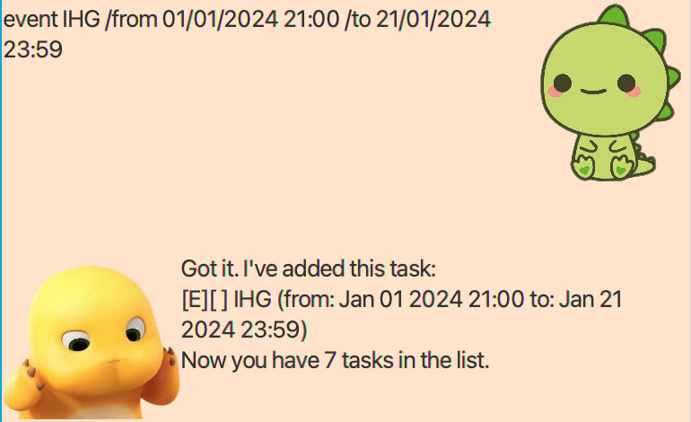
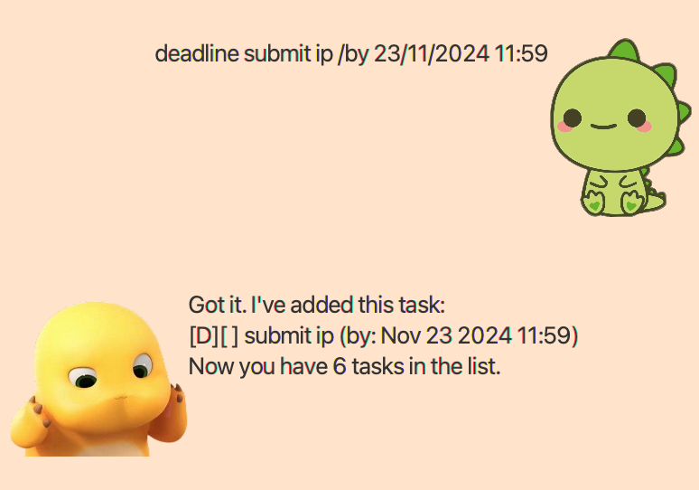
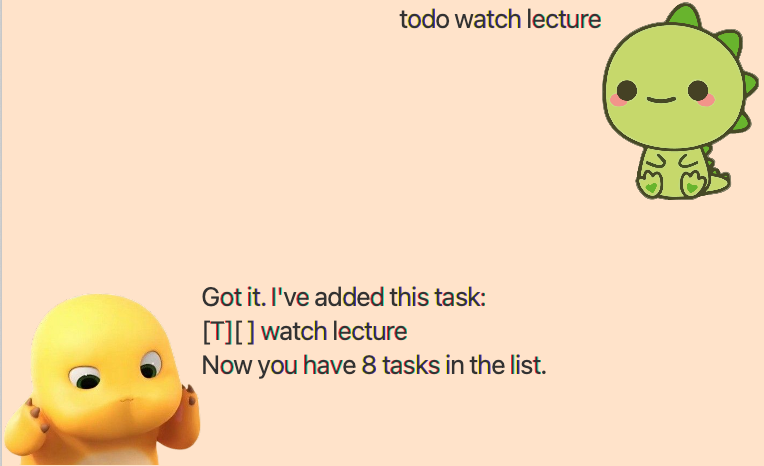
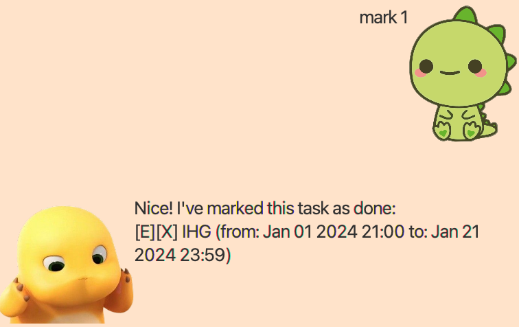
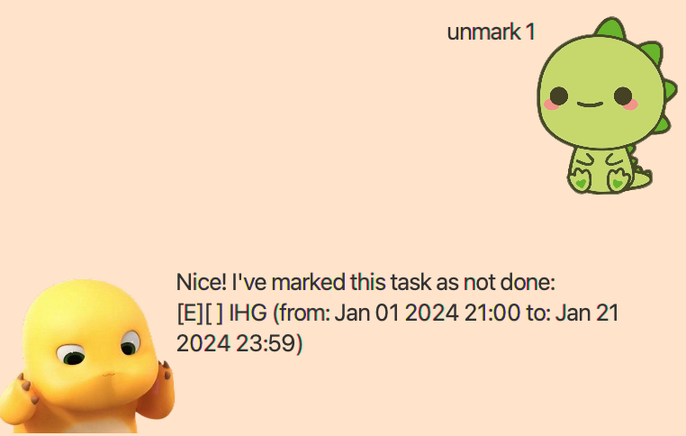
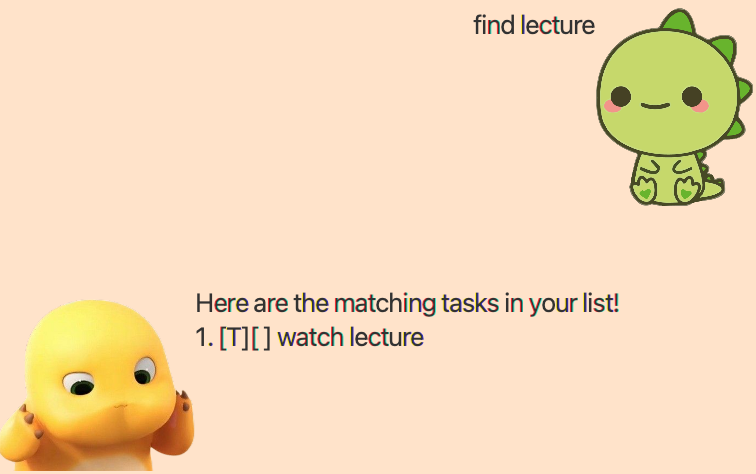
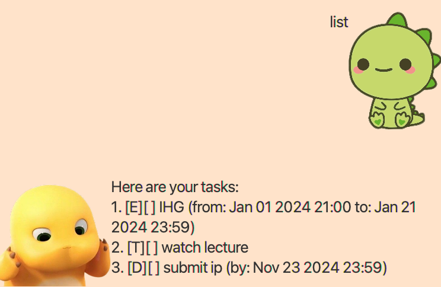
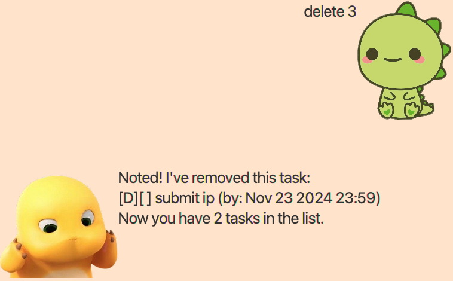
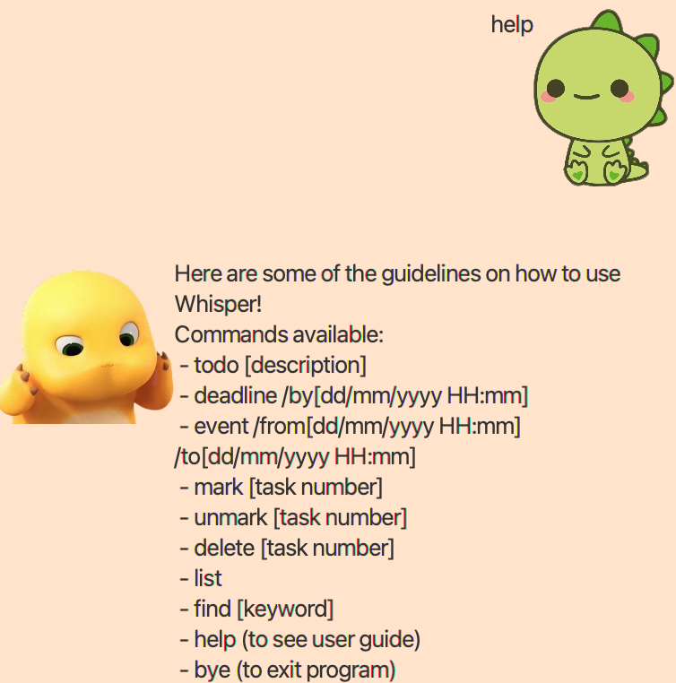

# Whisper User Guide


Whisper is a personal chatbot which helps to manage your daily tasks! 
Keep tracks on all your todos and upcoming events.

## Adding Events `event`

`event` is a support for task tracking which starts and ends on a specific date and time (24HR format).

Example: `event [description] /from dd/mm/yyyy HH:mm /to dd/mm/yyyy HH:mm`

Expected output:
The output will shows the description of the event added with the tag `[E]` and specify start and end date and time.
It will also show the total number of tasks in the list.
```
Got it. I've added this task: 
[E][] IHG (from: Jan 01 2024 21:00 to: Jan 21 2024 23:59)
Now you have 1 tasks in the list.
```


## Adding deadlines `deadline`

`deadline` is a support for task tracking which needed to be done on a specific date and time (24HR format).

Example: `deadline [description] /by dd/mm/yyyy HH:mm`

Expected output: 
The output will shows the description of the deadline added with the tag `[D]` and specify date and time. 
It will also show the total number of tasks in the list. 
```
Got it. I've added this task: 
[D][] submit ip (by: Nov 23 2024 11:59)
Now you have 2 tasks in the list.
```


## Adding Todos `todo`

`todo` is a support for task tracking without any date and time.

Example: `todo [description]`

Expected output:
The output will shows the description of the todo added with the tag `[T]`.
It will also show the total number of tasks in the list.
```
Got it. I've added this task: 
[T][] watch lecture
Now you have 3 tasks in the list.
```


## Marking tasks as Done `mark`

`mark` is a support for marking your task as done.

Example: `mark [task number]`

Expected output:
The output will shows the description of the task by marking it as done `[X]`.
```
Nice! I've marked this task as done: 
[E][X] IHG (from: Jan 01 2024 21:00 to: Jan 21 2024 23:59)
```


## Marking tasks as Not Done `unmark`

`unmark` is a support for marking your task as not done.

Example: `unmark [task number]`

Expected output:
The output will shows the description of the task by marking it as not done `[]`.
```
Nice! I've marked this task as not done: 
[E][] IHG (from: Jan 01 2024 21:00 to: Jan 21 2024 23:59)
```


## Finding tasks `find`

`find` is a support for users to find a task by searching for a keyword.

Example: `find [keyword]`

Expected output:
The output will shows the list of tasks containing the keyword.
```
Here are the matching tasks in your list!
1. [T][] watch lecture
```


## Listing tasks `list`

`list` is a support for to display all the tasks in the list.

Example: `list`

Expected output:
The output will shows the all tasks in the list.
```
Here are your tasks:
1. [E][] IHG (from: Jan 01 2024 21:00 to: Jan 21 2024 23:59)
2. [T][] watch lecture
3. [D][] submit ip (by: Nov 23 2024 11:59)
```


## Deleting task `delete`

`delete` is a support for deleting tasks from list.

Example: `delete [task number]`

Expected output:
The output will the task deleted. It also shows the total number of task in the list after deletion.
```
Noted! I've removed this task:
[D][] submit ip (by: Nov 23 2024 11:59)
Now you have 2 tasks in the list.
```


## In-App Guidance `help`

`help` is a support to provide guidance to the app.

Example: `help`

Expected output:
The output will show list of commands available for the user to use the app.
```
Here are some of the guidelines on how to use Whisper! 
Commands available: 
- todo [description]
- deadline [description] /by dd/mm/yyyy HH:mm
- event [description] /from dd/mm/yyyy HH:mm /to dd/mm/yyyy HH:mm
- mark [task number]
- unmark [task number]
- delete [task number]
- list
- find [keyword]
- help (to see user guide) 
- bye (to exit program) 
```


## Exiting program `bye`

`bye` is a support to exit the program.

Example: `bye`

Expected output:
The program will exit. 