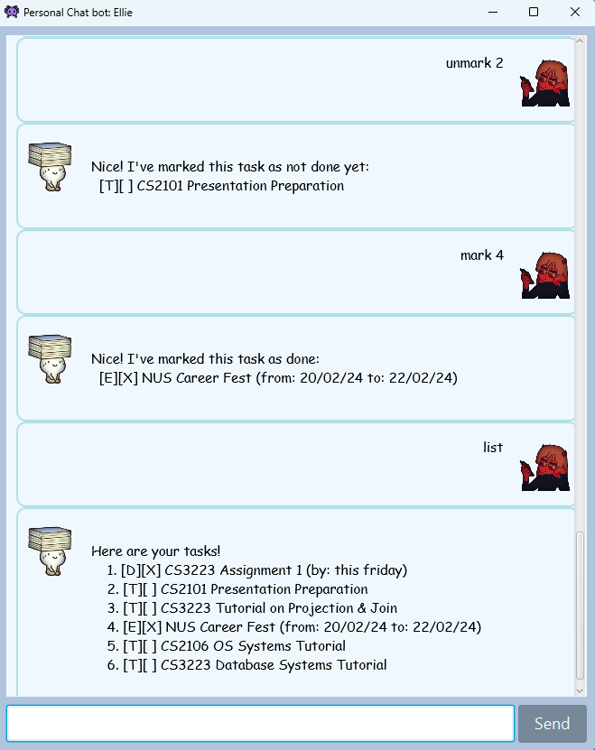
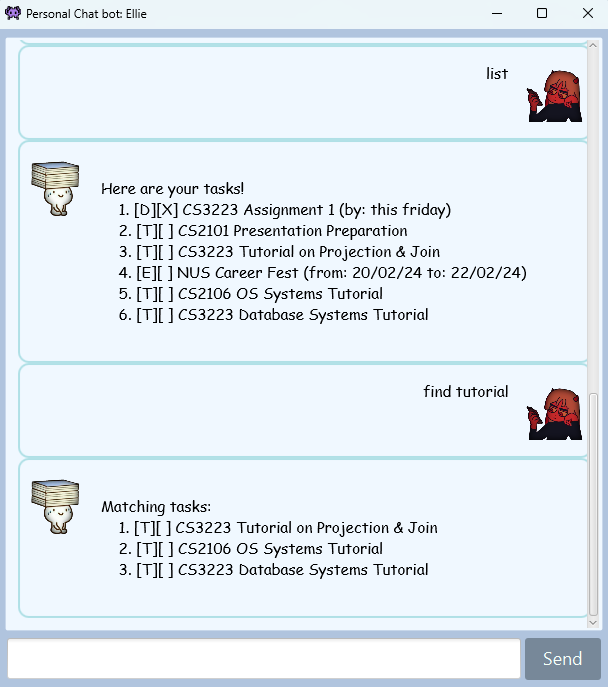

# Ellie User Guide

    

  <text> Snapshot of Ellie in Action! </text>
  
 

## User Guide for ChatBot "Ellie"

Welcome to ChatBot "Ellie"! Below is a comprehensive guide to help you navigate and make the most out of your
experience with Ellie. To begin interacting with Ellie, simply type your commands into the chat interface and press 
enter. Ellie will promptly respond with the appropriate action or information.
---

## Table of Contents:
1. [Setting Up Ellie](#1-setting-up)
1. [Getting Started](#2-getting-started)
1. [Available Commands](#3-available-commands)
1. [Feedback and Support](#4-feedback-and-support)

---

## 1. Setting Up

### Basic Guide: Set up Java and download Ellie

1. Download `Java 11`.
   * For Windows, download from [here](https://www.oracle.com/java/technologies/javase-jdk11-downloads.html).
   * For MacOS, follow this guide [here](https://docs.oracle.com/en/java/javase/11/install/installation-jdk-macos.html#GUID-2FE451B0-9572-4E38-A1A5-568B77B146DE).
1. Download the latest `Ellie-<version>.jar` from [here](https://github.com/gerteck/ip/releases).
1. After downloading, navigate to your 'Downloads' folder:
   * Create a folder to put the file in.
   * Navigate to that folder. Right click in the folder, and select `Open in Terminal` or `Open in Command Prompt`.
   * Run the command `java -jar Ellie-<version>.jar` to start Ellie. Replace `<version>` with the version number of the file you downloaded.

    

  <text> Snapshot of Ellie upon opening .jar file! </text>
  
 

## 2. Getting Started

To begin interacting with Ellie, simply type your commands into the chat interface and press enter. Ellie will promptly respond with the appropriate action or information.

> You can manage your tasks effectively using Ellie's commands. Whether it's marking tasks as complete, deleting tasks, or searching for specific tasks, Ellie has you covered.
{: .prompt-info }

Ellie comes with additional features such as error handling, command validation, and user-friendly feedback messages to enhance your experience.

## 3. Available Commands

Ellie supports various commands to help you manage your tasks. Here are some essential commands:

- **Adding Tasks:**
   - `todo [task]`: Adds a new to-do task.
   - `deadline [task] /by [deadline]`: Adds a task with a specific deadline.
   - `event [event] /from [start] /to [end]`: Adds an event with a start and end time.

- **Listing Tasks:**
   - `list`: Displays all tasks currently in the list.

- **Marking and Unmarking Tasks:**
   - `mark [task index]`: Marks a task as completed.
   - `unmark [task index]`: Unmarks a completed task.

- **Finding Tasks:**
   - `find [keyword]`: Searches for tasks containing the specified keyword.

- **Deleting Tasks:**
   - `delete [task index]`: Deletes a task from the list.

    

  <text> Using the mark and unmark commands! </text>
  
 

    

  <text> Try using the `find` command to search for keywords in your list! </text>
  
 

## 4. Feedback and Support
I value your feedback! If you have any suggestions for improving Ellie or 
if you need assistance, please don't hesitate to reach out. 
Your feedback helps to improve Ellie and provide a better user experience for everyone.

Feel free to open an issue on [GitHub](https://github.com/gerteck/ip/issues), to report any bugs, 
or enhancements you want to see!