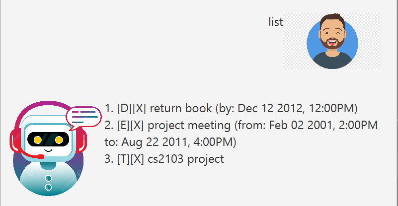
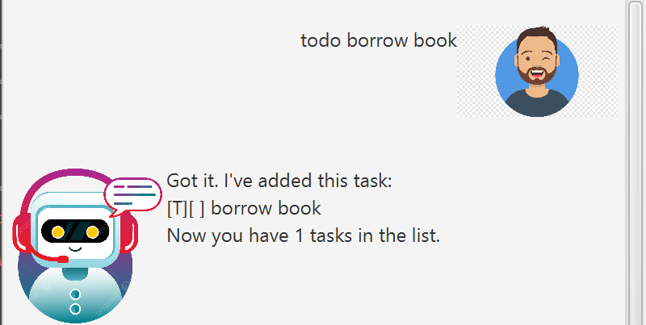
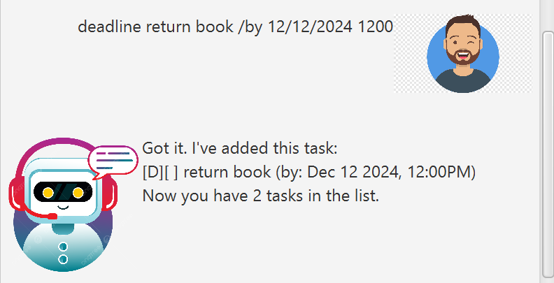
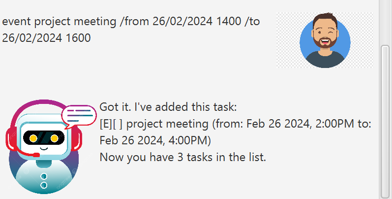
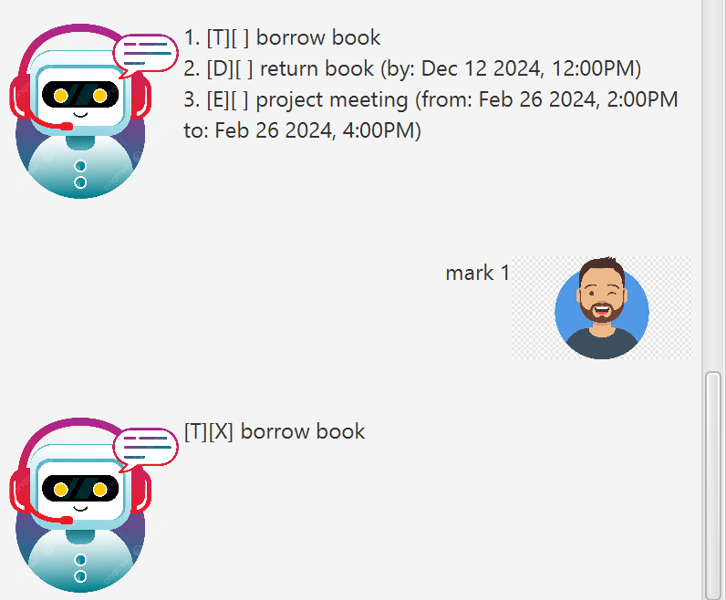
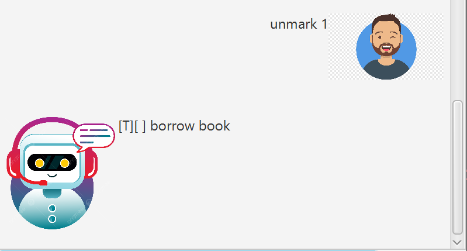
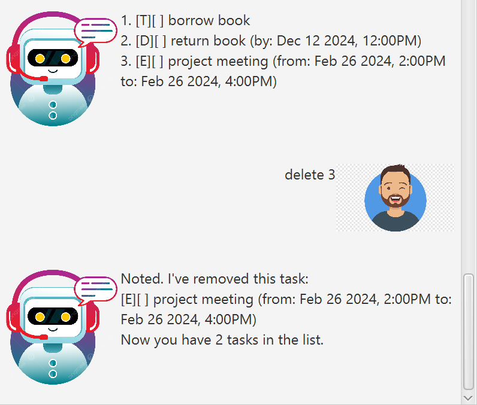
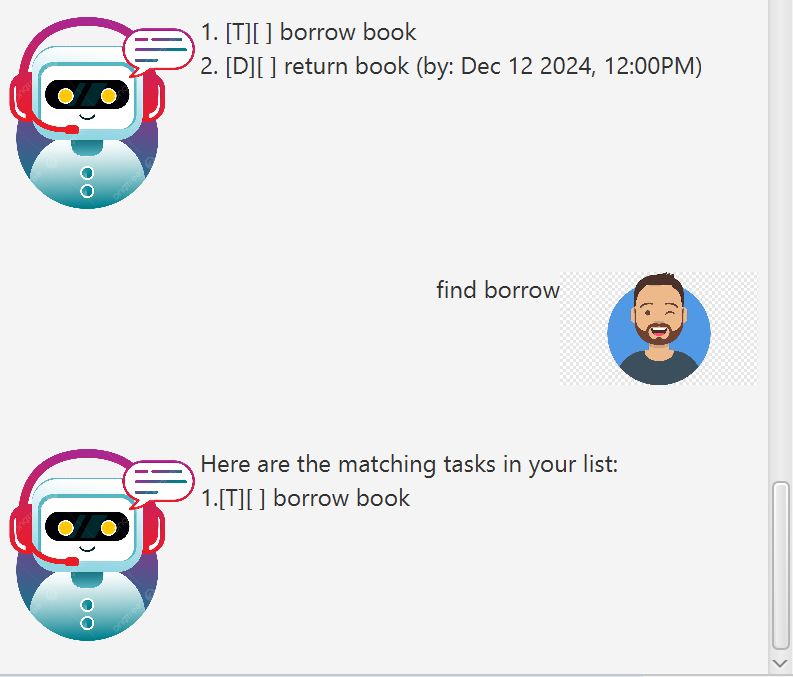

# HughJazz User Guide

HughJazz is a Chatbot Task Manager for your everyday tasks!

## List your current task list
To display your current task list: `list`  

## Adding todo tasks, deadlines and events
*All timings should follow dd/MM/yyyy HHmm format*
1. To add a new todo task, simply enter `todo {description}`
2. To add a new deadline, simply enter `deadline {description} /by {by timing}`
3. To add a new deadline, simply enter `event {description} /from {from timing} /to {to timing}`

Example: `todo borrow book`  
Example: `deadline return book /by 12/12/2012 1200`  
Example: `event project meeting /from 02/02/2001 1400 /to 22/08/2011 1600`  

## Mark and Unmark tasks 
*A marked task is indicated by an 'X' in the square brackets in front of the task*
 
 
To mark a task as done: `mark {task number}`  
  
 
To unmark a task as done: `unmark {task number}`  

## Delete a task
To delete a task from your task list: `delete {task number}` 

## Find tasks by keyword
To find matching tasks from your task list based on a keyword: `find {keyword}` 

## Exiting the window
To exit the application: `bye`  
 
*Exiting the application automatically saves the current task list and its details in the application*
 
*Upon reloading the application again, your tasks will be automatically loaded into the application, allowing you to resume your progress!*