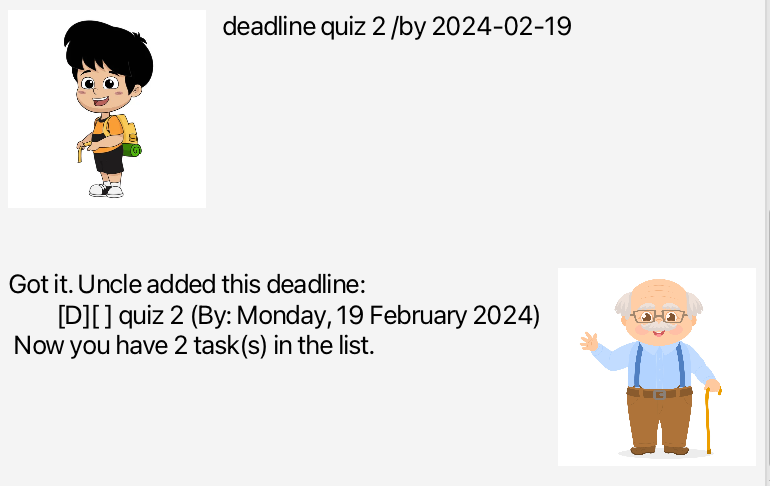
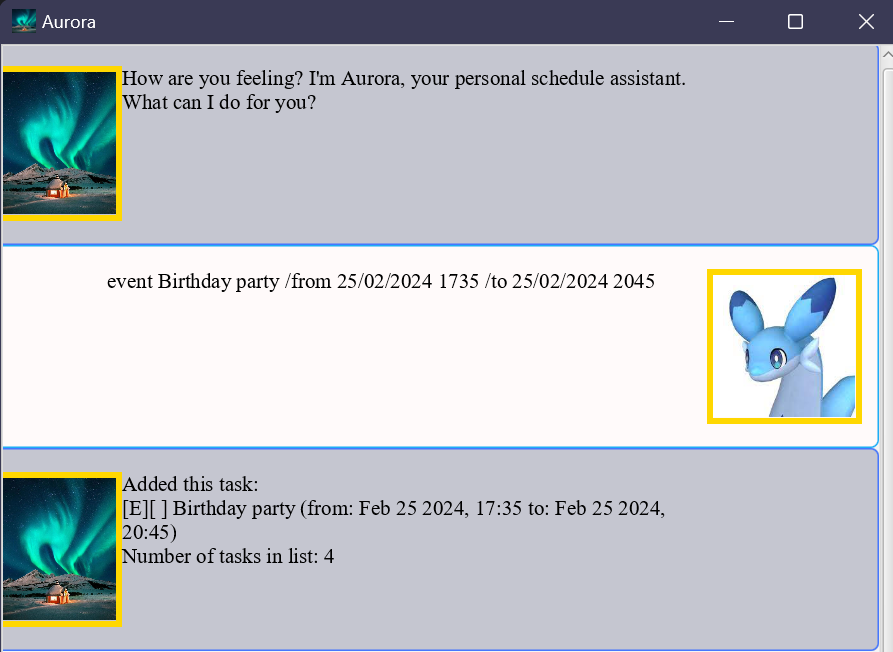
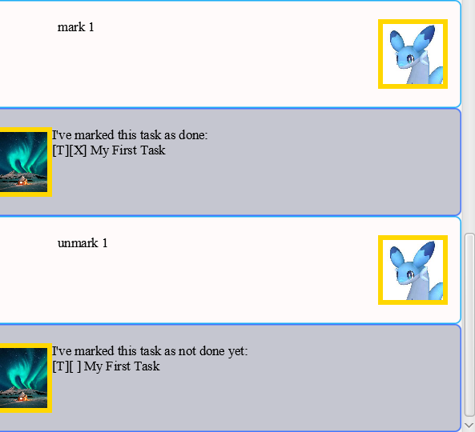
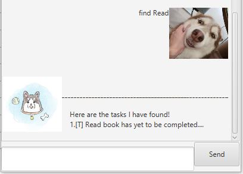

# Aurora: Your personal scheduling assistant 


## Introduction
Welcome to the world where chaos meets order, where ideas turn into actions, and where your daily tasks find a cozy 
home!

Welcome to Aurora, a desktop *companion* for managing your future tasks, be it to-dos, deadlines or events. Aurora 
isn't just a lifeless task list, it is a friend to you as well!

## Getting started
Getting started with Aurora is as easy as 1, 2 and 3:
1. Ensure that you have Java 11 installed on your device. (Aurora has been tested for both Windows and Mac!)
2. Download the jar file into an empty folder.
3. Double click to launch the application!

Once you've launched the application, expect to be greeted by your new companion:


From here, you can try typing in a command and pressing enter to execute it, below are 2 sample commands you can try:
1. ```todo``` My First Task (Adds a new Todo to your task list named "My First Task".)
2. ```list``` (Displays your task list.)

You should be able to see this on the application:


## Features
Now that you've gotten the first taste of using the application, here are the full features and commands of Aurora, 
all at your 
fingertips. In this section, follow along and enter all the example commands to see the outputs provided in the images.

### Display your task list: ```list```
The ```list``` command displays your current task list. Remember that you can always use the list command to check 
if your tasks are being properly added to your task list.

### Add a Todo task: ```todo```
The ```todo``` command allows you to add a "To-do" task to your task list by entering ```todo```, followed by the 
description of the To-do task you wish to add.

Input format: ```todo {Task Description}```

Examples: 
1. ```todo``` Read a book
2. ```todo``` Do my homework

You should be able to see the following outputs: 


### Add a Deadline: ```deadline```
The ```deadline``` command allows you to add a "Deadline" task to your task list, along with a date you wish to 
complete this task before.

Input format: ```deadline {Task Description} /by {Deadline date and time}```

Date and time format:  ```dd/MM/yyyy HHmm```

Example: ```deadline``` Submit CS2103T iP /by 25/02/2024 2359

You should be able to see the following output:



### Add an Event: ```event```
The ```event``` command allows you to add an "Event" task with a description, start datetime and end datetime to 
your task list.

Input format: ```event {Task Description} /from {Start datetime} /to {End datetime}```

Date and time format:  ```dd/MM/yyyy HHmm```

Example: ```event``` Birthday party /from 25/02/2024 1735 /to 25/02/2024 2045

You should be able to see the following output:


### Add a DoAfter: ```doafter```
The ```doafter``` command allows you to add a "DoAfter" task with a description and either a datetime you would like 
to do the task after, or another task in the list you wish to do this task after.

Input formats: 
1. ```doafter {TaskDescription} /after {Datetime to do task after}```
2. ```doafter {TaskDescription} /after {Index of event you want to perform this task after in your task list}```

Example: 
1. ```doafter``` Return book /after 27/03/2024 1900
2. ```doafter``` Have a coffee /after 3 (This would cause the doAfter to be described as to be done after task 3 in 
   your 
   task list.)

Here are the outputs that you should see:


### Mark a task as "done": ```mark```
The ```mark``` command allows you to mark a specific task in your task list as done.

Input format: ```mark {Index of the task in the task list you wish to mark as done}```

Example: ```mark``` 1 (Marks the first task in the task list as done, denoted by a [x] in the second set of brackets.)

### Unmark a task so it is now "not done": ```unmark```
The ```unmark``` command allows you to mark a done task as not done.

Input format: ```unmark {Index of the task in the task list you wish to mark as not done}```

Example: ```unmark``` 1 (Marks the first task in the task list as not done.)

Entering ```mark``` 1 and then ```unmark 1``` should produce the following outputs:


### Find tasks by keyword: ```find```
Ever wanted to search for specific tasks? Use the ```find``` command to find the sub-list of tasks that contain a 
specific keyword within your task list.

Input format: ```find {Keyword}```

Example: ```find``` CS2103T

You should be able to see the following output:


### Deleting a task: ```delete```
To delete a task from the task list, use the ```delete``` command followed by the index of the task you wish to delete.

Input format: ```delete {Index of task to be deleted}```

Example: ```delete``` 3 (Deletes the 3rd task on the task list)

You should be able to see the following output:


### Ending your current session with Aurora: ```bye```
Say goodbye to Aurora with the ```bye``` command, upon which Aurora will print a farewell message for you and 
automatically exit in 3 seconds. 

## FAQ
**Q**. Why is my Aurora application not running?

**A**. Here are some steps you can use to troubleshoot your issue:
1. Ensure that you have Java 11 installed on your device.
2. Check that you have "write" access in the folder you downloaded Aurora to.
3. Ensure that Aurora is creating a "data" folder within the folder you downloaded Aurora to.

**Q**. What happens when I delete a task associated with another DoAfter task?

**A**. No worries, Aurora is programmed to indicate that your task associated with the DoAfter task has been deleted 
previously. It will not affect the application.

**Q**. How should I interpret the entries on the task list?

**A**. The entries on the task list have a general format: 

```[Type of task]['X' if done, blank if not done] {Description} (Further description based on type of task)```

**Q**. Is it possible to transfer my task list from one device to another?

**A**. Of course! The task list is stored as a text file named aurora within the data folder created by the 
application. Simply transfer the data folder into your new device, into the same folder as your intend to download 
Aurora into, and you will be able to access the same task list.

**Q**. What happens when I enter a random command that isn't included in the user guide into the application?

**A**. Aurora will express that she doesn't understand what you are referring to and provide a list of valid 
commands for you to use.