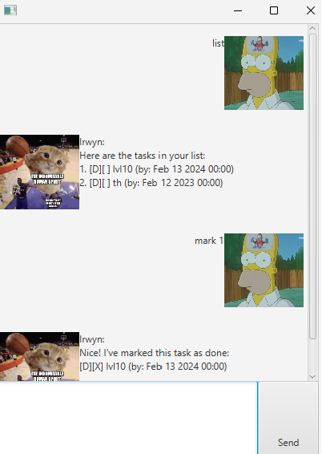
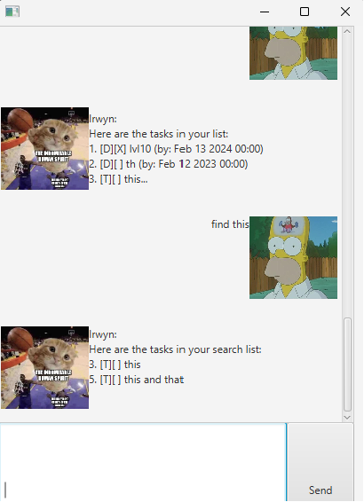

# User Guide

Irwyn is a task tracker chatbot that helps you organise your tasks.
- [Quick start](#quick-start-anchor)
- [Features](#features-anchor)
    - [Add a todo task: `todo`](#feature-todo-anchor)
    - [Add a deadline task: `deadline`](#feature-deadline-anchor)
    - [Add an event task: `event`](#feature-event-anchor)
    - [List all tasks: `list`](#feature-list-anchor)
    - [Mark a task as done: `mark`](#feature-mark-anchor)
    - [Unmark a task: `unmark`](#feature-unmark-anchor)
    - [Delete a task: `delete`](#feature-delete-anchor)
    - [Find a task: `find`](#feature-find-anchor)
    - [Sort the tasks: `sort`](#feature-sort-anchor)
    - [End the chat bot: `bye`](#feature-bye-anchor)
    - [Save the data](#feature-save-anchor)

## Quick start 
1. Ensure you have Java `11` or above installed in your Computer.

2. Download the latest `irwyn.jar` from [here](https://github.com/irwynliong/ip/releases/tag/v0.1).

3. Copy the file to an empty folder for your Irwyn chatbot.

4. Open a terminal, `cd` into the folder you put the jar file in, and 
use the `java -jar irwyn.jar` command to run the application.
A GUI similar to the below should appear in a few seconds.

5. Type the command in the chat box and click send to execute it!
   

## Features 

>ℹ️ Notes about the command format:
>- words in upper `UPPER_CASE` are the parameters to be supplied by the user.
   e.g. in delete NUMBER, NUMBER is a parameter which can be used as delete 1.
>- Items in square brackets are optional.
   e.g todo [TODO] can be used as todo anything or as todo.
>- Extraneous parameters for commands (such as list, bye & sort) are allowed
   e.g. if the command specifies list 123, it will still execute the commands.
>- If you are using a PDF version of this document, be careful when copying and
   pasting commands that span multiple lines as space characters surrounding line-breaks
   >may be omitted when copied over to the application.

####  Add a todo task: `todo` 
Adds an todo task to the task list.

Format: `todo [TODO]`

Tip: An empty todo is still a todo

Examples:
- `todo task 1`
- `todo task 2`

#### Add a deadline task: `deadline`
Adds a task with a deadline to the task list.

Format: `deadline TASK /by DATE&TIME`
>Note : The Date and Time format has to be YYYY-MM-DD [HH:MM:SS]
Examples:
- `deadline task /by 2023-06-01 15:00`
- `deadline submission /by 2023-08-01`

#### Add an event task: `event`
Adds an event task that has a start and end to the task list.

Format: `event TASK /from START /to END`
>Note : For events, the start and end has no fixed formats.

Examples:
- `event artbox /from yesterday /to tomorrow`
- `event lecture /from 10:00 /to 12:00`

#### List all tasks: `list`
Shows your current list of tasks.

Format: `list`

#### Mark a task as done: `mark`
Marks the task you specified as done.

Format: `mark INDEX`

- Marks the task at the INDEX with a cross. The index refers to the number beside the tasks in the list.
The index must be a positive integer 1, 2, 3, …​
  (e.g. 1. [T][ ] task)

Examples:
- `mark 1` returns [T][X] task

#### Unmark a task: `unmark`
Unmarks the task you specified as not done.

Format: `unmark INDEX`

- Unmarks the task at the INDEX (removes the cross). The index refers to the number beside the tasks in the list. 
The index must be a positive integer 1, 2, 3, …​
  (e.g. 1. [T][X] test)

Examples:
- `unmark 1` returns [T][] test 1

#### Delete a task: `delete`
Deletes the task at that specified index for the current list.

Format: `delete INDEX`

- Deletes the task at INDEX. The index refers to the number beside the tasks in the list. 
The index must be a positive integer 1, 2, 3, …​

Examples:
- `list` followed by `delete 2` deletes the 2nd task in the task list displayed by Irwyn chatbot.

#### Find a task: `find`
Finds all tasks whose description contain any of the given words.

Format: `find [KEYWORDS]`
- The search is case-sensitive. e.g `task` will NOT match `Task`
- The order of the keywords does matter. e.g. `this task` will NOT match `task this`
- As long as the task contains the words in the correct order, they will be matched e.g. find `tas` returns `task`

Examples:
- `find this` returns `this` and `that and this`
- `find test` returns `test`
  

#### Sort the tasks: `sort`
Sorts the tasks in the list.

Format: `sort`

>Note: The type of the task has to be considered in the sorting as well, e.g. deadline < todo (d < t)

#### End the Irwyn chatbot: `bye`
Exits the program.

Format: `bye`

#### Save the data
Irwyn chatbot data is saved in the hard disk automatically after any command that changes the data.
There is no need to save manually.

#### Edit the data
Irwyn chatbot data are saved automatically as a txt file
{JAR file location}/storage/taskData.txt.
Advanced users are welcome to update data directly by editing that data file.
>❗️Caution: If your changes to the data file makes its format invalid, Irwyn
> will not be able to run.
> Hence, it is recommended to have a backup of the file before editing it.

## FAQ 
Q: How do I transfer my data to another Computer?
A: Install the jar file in the other computer and overwrite the existing taskData.txt 
with the file that contains the data from your current computer.

## Known issues 
1. when executing the bye command, the GUI does not close immediately. 
You can just click the exit button at the top right and it will exit the programme.

## Command list summary 

| Command      | Format, Examples                                                                      |
|--------------|---------------------------------------------------------------------------------------|
| Add todo     | `todo [TODO]`  e.g. `todo task 1`                                                 |
| Add event    | `event TASK /from START /to END` e.g. `event artbox /from yesterday /to tomorrow` |
| Add deadline | `deadline TASK /by DATE&TIME` e.g.`deadline task /by 2023-06-01 15:00`            |
| list         | `list`                                                                                |
| mark         | `mark INDEX` e.g.`mark 1`                                                         |
| unmark       | `unmark INDEX` e.g.`unmark 1`                                                     |
| delete       | `delete INDEX` e.g.`delete 1`                                                     |
| find         | `find [KEYWORDS]` e.g.`find this`                                                 |
| sort         | `sort`                                                                                |
| bye          | `bye`                                                                                 |
