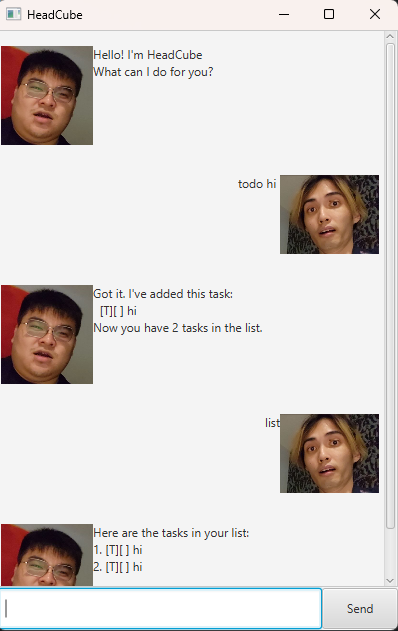
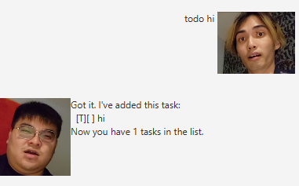
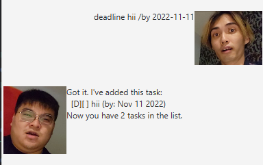
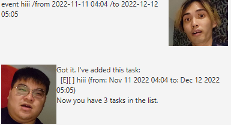
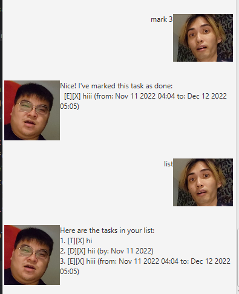
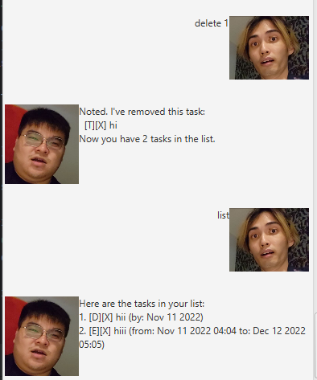
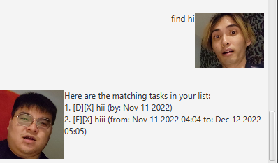
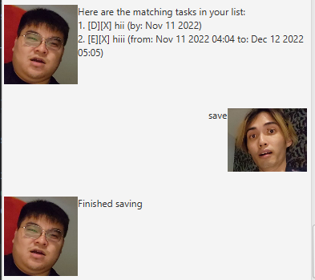
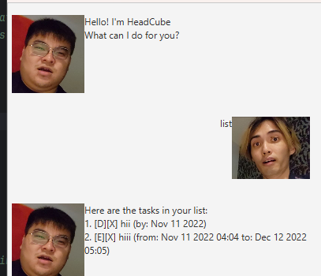

# HeadCube User Guide
HeadCube helps you keep tracks of the things you need to do! 

## List your tasklist
By using the command list, Headcube will display what you need to do!

## Adding tasks, deadlines and events
1. To add a task, just key in todo [task]
2. To add a deadline, key in deadline [task] /by YYYY-MM-DD
3. To add an event, key in event [task] /from YYYY-MM-DD HH:MM /to YYYY-MM-DD HH:MM

## Mark your task as done
You can mark your task as done by using mark [task number].

## Delete the task
You can also delete the task when it becomes obsolete by using delete [task number].

## Find the task
Find the task by find [keyword].

## Save the task and Load upon relaunch
You can save your current tasks by just keying in save. 
The next time you load the application it will load as your current tasks.

## Enjoy
Have fun using this to track!
