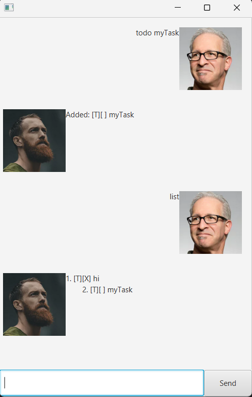
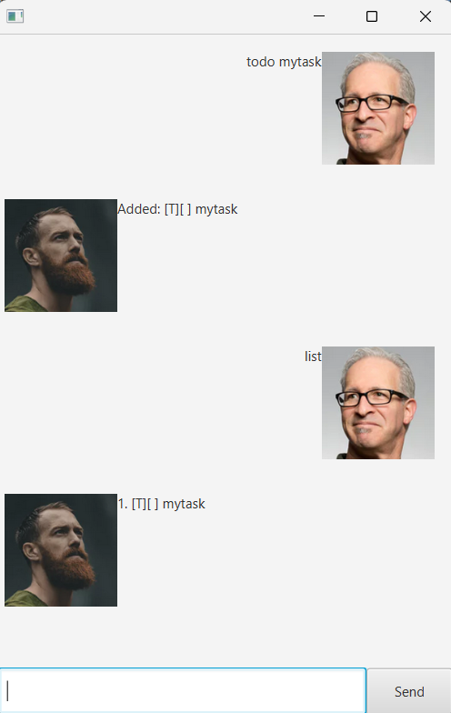

# Joseph Joshtur User Guide



**Joseph, your handy tool for managing tasks.**

# Features

## Viewing your tasks

Command: list

Shows all the tasks you have added

   

## Adding todo

Command: todo [description]

Adds a todo with a description

Example of usage:
```
todo read book
```

## Adding deadlines

Command: deadline [description] /by [date]

Adds a deadline at specified date with a description 
Date must follow YYYY-MM-DD format

Example of usage: 

```
deadline return book /by 2020-12-12
```

## Adding events

Command: event [description] /from [date] /to [date]
Adds an event with 'from' date and 'to' date
Date must follow YYYY-MM-DD format

Example of usage:
```
event project meeting /from 2020-12-12 /to 2020-12-13
```

## Marking tasks as done

Command: mark [task number]

Marks the task at the specified task number as done

Example of usage:
```
mark 1
```

## Marking tasks as undone

Command: unmark [task number]

Marks the task at the specified task number as undone

Example of usage:
```
unmark 1
```

## Deleting tasks

Command: delete [task number]

Deletes the task at the specified task number

Example of usage:
```
delete 1
```

## Finding tasks

Command: find [keyword]

Finds tasks with the specified keyword

Example of usage:
```
find book
```

## Exiting

Command: bye

Exits the application

Example of usage:
```
bye
```