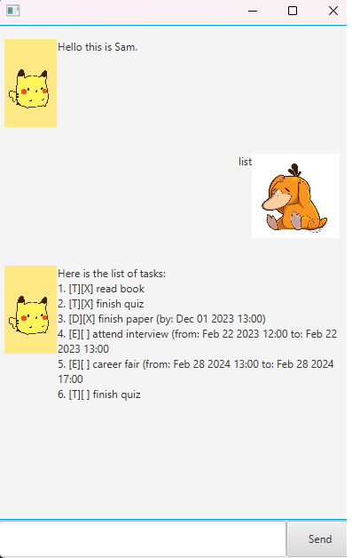

# **RizBot User Guide**

Hello! This is RizBot, a todo-list manager that is based off the mannerisms of my close friend Rizwan Khan.  

**It is encouraged that you use the buttons provided in the interface for ease of use.**  

**This a sample use case of the RizBot**\

## **Adding Tasks Guide**
**Be sure to input the time in 24h format for Deadline and Event tasks!**
### Adding Todo Tasks
Format: todo **INSERT_TASK_HERE**
### Adding Deadline Tasks (With a deadline)
Format: deadline **INSERT_TASK_HERE** /by dd/mm/yyyy hhmm
### Adding Event tasks (With a time frame)
Format: event **INSERT_TASK_HERE** /from dd/mm/yyyy hhmm /to dd/mm/yyyy hhmm

## **Features to manage your tasklist**
### List
This showcases all the tasks that are currently in the tasklist.
### Mark
This marks a task as complete, based on its numerical index.\
Format: mark **INSERT_TASK_INDEX**
### Unmark
This unmarks a task as incomplete, based on its numerical index.\
Format: UNMARK **INSERT_TASK_INDEX**
### Find
Find a task based off of the name of the task, even if the search input only matches partially.\
Format: find **INSERT_COMPLETE_OR_PARTIAL_TASK_NAME**
### Delete
Deletes a task based on its numerical index.\
Format: delete **INSERT_TASK_INDEX**
### Clear List
Deletes all tasks in the tasklist.