# Ypxmm
> If you fail to plan, you plan to fail.

## Overview

Ypxmm is your go-to, true-blue Singaporean task manager bot. It is:

- text-based
- user-friendly
- very fast to use


## Getting started

1. Download it from [here](https://github.com/appleraincoat/ip/releases/tag/A-Jar)
2. Open the folder with Command Prompt
3. Run java -jar Ypxmm.jar

And you are done! Lets go! :smile:


## Features
- [x] Add 3 types of tasks, Todos, Deadlines and Events
- [X] List, Mark & Unmark and Delete tasks
- [ ] Assign priorities to tasks (**Coming soon**)
- [ ] Edit tasks (**Coming soon**)

### Viewing help: ```getcommands```

Run ```getcommands``` for the bot to return a list of the commands available and examples on how to use them.

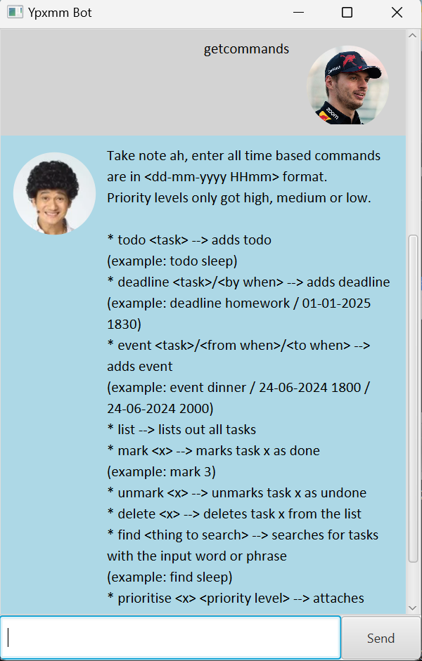

### Adding a Todo task: ```todo```

Adding a Todo task to the list of tasks. 

Format: ```todo <name>```

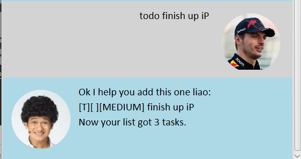
### Adding a Deadline task: ```deadline```
Adding a Deadline task to the list of tasks.

Format: ```deadline <name> / <dd-MM-yyyy hhmm>```

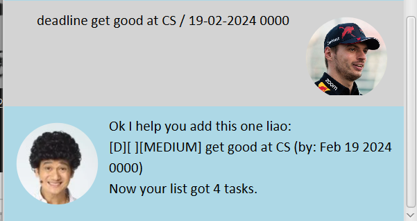
### Adding an Event task: ```event```
Adding an Event task to the list of tasks.
The first date represents the start time of the event, and the second date represents the end time of the event.

Format: ```event <name> / <dd-MM-yyyy hhmm> / <dd-MM-yyyy hhmm>```

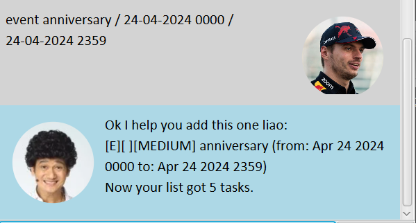
### List out tasks: ```list```
Lists out all tasks currently in the task list.

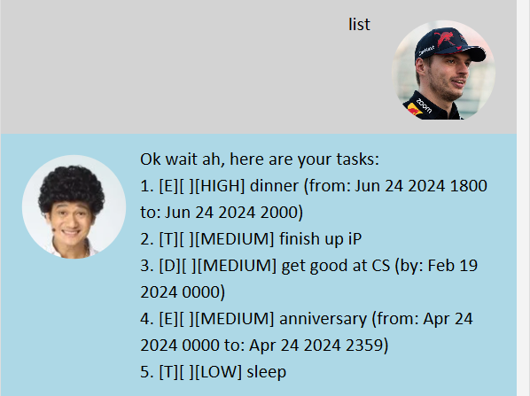

> :spiral_notepad: **Note:** The list always sorts tasks from highest priority to lowest priority.

### Marking a task: ```mark```

Marks a task in the task list as done.

Format: ```mark <x>```


> :bulb: **Tip:** List out the task list before marking to see which ranking the task is. 

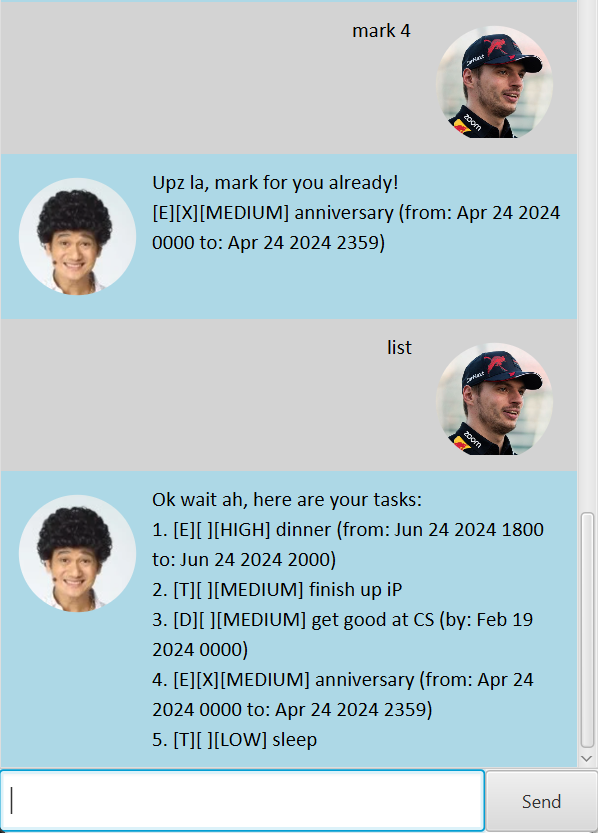
### Unmarking a task: ```unmark```

Unmarks a task in the task list as undone.

Format: ```unmark <x>```


> :bulb: **Tip:** List out the task list before unmarking to see which ranking the task is. 

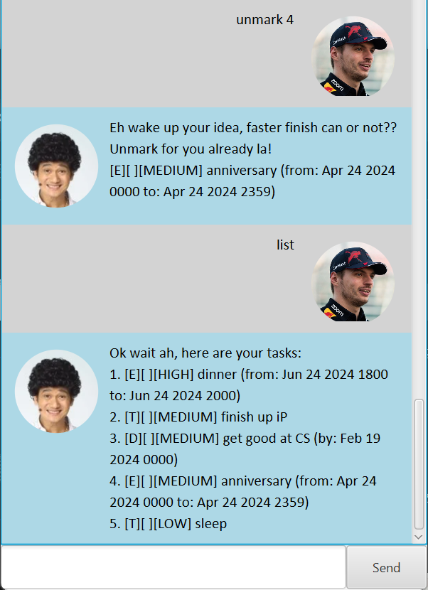
### Deleting a task: ```delete```
Deletes a task in the task list.

Format: ```delete <x>```


> :bulb: **Tip:** List out the task list before deleting to see which ranking the task is. 

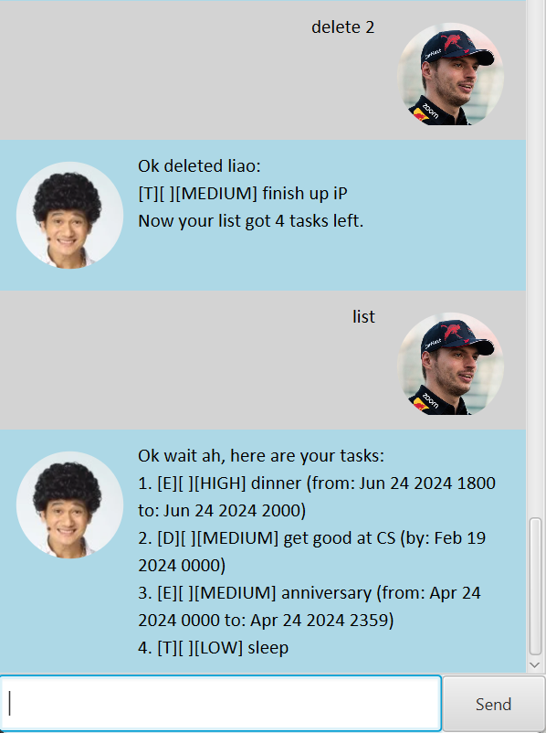
### Finding a task: ```find```

Finds a task in the list of tasks with a specified keyword/phrase.

Format: ```find <name>```

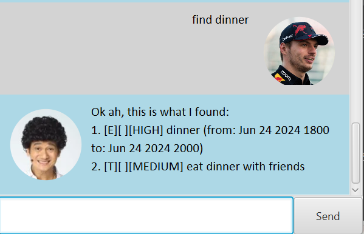
### Prioritising a task: ```prioritise```
Sets the priority of a task in the task list.

Format: ```prioritise <x> high```


> :bulb: **Tip:** List out the task list before prioritising to see which ranking the task is. 

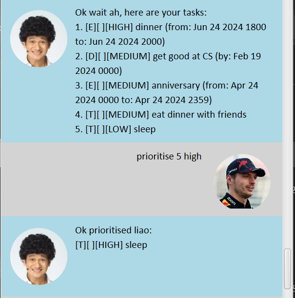

> :spiral_notepad: **Things to take note of:**
> - There are 3 levels of priority: high, medium and low.
> - Tasks are assigned "medium" priority by default.
> - Changing task priorities can only be done with this command.


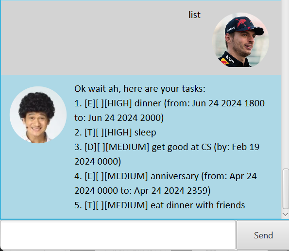

And this is the result! Note that the list will re-sort itself according to priority.
### Exiting the program: ```bye```
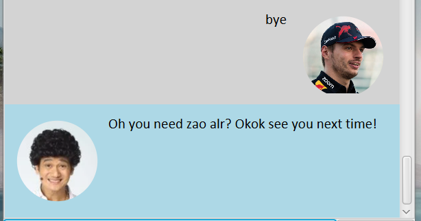

I hope you enjoy using the bot!

## Additional Information

The following are some pieces of additional information to take note of.

### Bad commands
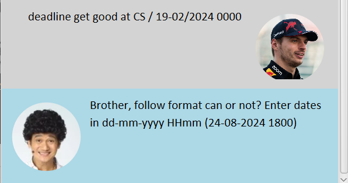

When using a command wrongly, the bot will always try to advise on your mistake and how to correct it.

Should you still be unable to use it, you may call ```getcommands``` for examples on the correct usage.

### Implementation info
This program is written in Java. The launcher class is listen below.
```angular2html
public class Launcher {
    public static void main(String[] args) {
        Application.launch(Main.class, args);
    }
}
```
