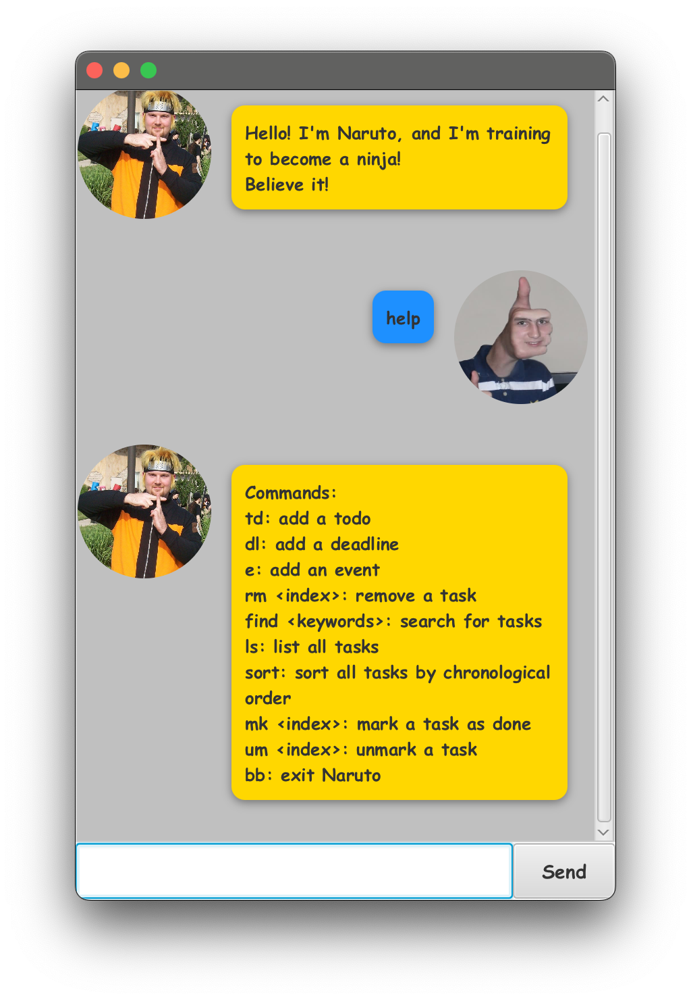

# Naruto User Guide

Naruto is a **desktop app for managing todos, events, and deadlines, optimized for use via a Command Line Interface** (CLI) while still having the benefits of a Graphical User Interface (GUI), with a Naruto-flavoured twist! If you can type fast, Naruto can track your tasks faster than traditional GUI apps.

--------------------------------------------------------------------------------------------------------------------

## Quick start

1. Ensure you have Java `11` or above installed in your Computer.

1. Download the latest `naruto.jar` from [here](https://github.com/itstrueitstrueitsrealitsreal/ip/releases).

1. Copy the file to the folder you want to use as the _home folder_ for Naruto.

1. Open a command terminal, `cd` into the folder you put the jar file in, and use the `java -jar naruto.jar` command to run the application. 
   A GUI similar to the below should appear in a few seconds. Note how the app contains some sample data. 
   

1. Type the command in the command box and press Enter to execute it. e.g. typing **`help`** and pressing Enter will open the help window. 
   Some example commands you can try:

    * `list` or `ls` : Lists all contacts.

    * `todo borrow book` or `td borrow book` : Adds a todo with the description `borrow book` to your list of tasks.

    * `delete 3` : Deletes the 3rd task shown in the current list.

    * `bye` or `bb` : Exits the app.

1. Refer to the [Features](#features) below for details of each command.

--------------------------------------------------------------------------------------------------------------------

## Features

**:information_source: Notes about the command format:** 

* Words in `UPPER_CASE` are the parameters to be supplied by the user. 
  e.g. in `deadline DESCRIPTION /by DD/MM/YYYY HHMM`, `NAME` is a parameter which can be used as `deadline naruto marathon /by 02/02/2020 0200`.

* Parameters must be in fixed order. 

* If you are using a PDF version of this document, be careful when copying and pasting commands that span multiple lines as space characters surrounding line-breaks may be omitted when copied over to the application.

### Viewing help : `help`

Shows a message explaning how to access the help page.

Format: `help`

### Adding a todo : `todo` or `td`

Adds a todo to the task list.

Format: `todo DESCRIPTION​` or `td DESCRIPTION`

Examples:

* `td return book`
* `todo math homework`

### Adding a deadline : `deadline` or `dl`

Adds a deadline to the task list.

Format: `deadline DESCRIPTION /by DD/MM/YYYY HHMM​` or `dl DESCRIPTION /by DD/MM/YYYY HHMM​`

Examples:

* `deadline return book /by 2/12/2019 1800`
* `dl return book /by 2/12/2019 1800`

### Adding an event : `event` or `e`

Adds an event to the task list.

Format: `event DESCRIPTION /from DD/MM/YYYY HHMM /to DD/MM/YYYY HHMM​`

Examples:

* `event CS2103 Tutorial /from 2/02/2024 0800 /to 2/02/2024 0900`
* `e CS2103 Tutorial /from 2/02/2024 0800 /to 2/02/2024 0900`

### Listing all tasks : `list` or `ls`

Shows a list of all tasks in the task list.

Format: `list`

### Locating tasks by description : `find`

Finds tasks whose descriptions contain any of the given keywords.

Format: `find KEYWORD [MORE_KEYWORDS]`

* The search is case-sensitive. e.g `return` will not match `Return`
* The order of the keywords does not matter. e.g. `return book` will match `book return`
* Only the description is searched.
* Partial words will be matched e.g. `ret` will match `return`

Examples:

* `find return` returns `return book`

### Deleting a task : `delete` or `rm`

Deletes the specified task from the task list.

Format: `delete INDEX` or `rm INDEX`

* Deletes the task at the specified `INDEX`.
* The index refers to the index number shown in the displayed task list.
* The index **must be a positive integer** 1, 2, 3, …​

Examples:

* `delete 2` deletes the 2nd task in the task list.

### Marking a task as done : `mark` or `m`

Marks the task at the specified index as done.

Format: `mark INDEX` or `mk INDEX`

* Marks the task at the specified `INDEX`.
* The index refers to the index number shown in the displayed task list.
* The index **must be a positive integer** 1, 2, 3, …​

Examples:

* `mark 2` marks the 2nd task in the task list.

### Unmarking a task : `unmark` or `um`

Unmarks a previously marked task at the specified index.

Format: `unmark INDEX` or `um INDEX`

* Unmarks the task at the specified `INDEX`.
* The index refers to the index number shown in the displayed task list.
* The index **must be a positive integer** 1, 2, 3, …​

Examples:

* `unmark 2` unmarks the 2nd task in the task list.

### Sorting all tasks : `sort`

Sorts all tasks in the task list in order of occurrence.

Format: `sort`

### Exiting the program : `bye` or `bb`

Exits the program.

Format: `bye` or `bb`

### Saving the data

Naruto's data is saved in the hard disk automatically after any command that changes the data. There is no need to save manually.

### Editing the data file

Naruto's data is saved automatically as a `.txt` file `[JAR file location]/src/logs/tasks.txt`. Advanced users are welcome to update data directly by editing that data file.

**Caution:**
If your changes to the data file makes its format invalid, Naruto will discard all data and start with an empty data file at the next run. Hence, it is recommended to take a backup of the file before editing it. 
Furthermore, certain edits can cause Naruto to behave in unexpected ways (e.g., if a value entered is outside of the acceptable range). Therefore, edit the data file only if you are confident that you can update it correctly.

## Command summary

Action | Format, Examples
--------|------------------
**Todo** | `todo DESCRIPTION` or `td DESCRIPTION`  e.g., `todo return book`
**Deadline** | `deadline DESCRIPTION /by DD/MM/YYYY HHMM` or `dl DESCRIPTION /by DD/MM/YYYY HHMM`  e.g., `deadline return book /by 2/12/2019 1800`
**Event** | `event DESCRIPTION /from DD/MM/YYYY HHMM /to DD/MM/YYYY HHMM` or `e DESCRIPTION /from DD/MM/YYYY HHMM /to DD/MM/YYYY HHMM`  e.g., `event CS2103 Tutorial /from 2/02/2024 0800 /to 2/02/2024 0900`
**List** | `list` or `ls`
**Find** | `find KEYWORD [MORE_KEYWORDS]`  e.g., `find return book`
**Delete** | `delete INDEX` or `rm INDEX`  e.g., `delete 3`
**Mark** | `mark INDEX` or `mk INDEX`  e.g., `mark 2`
**Unmark** | `unmark INDEX` or `um INDEX`  e.g., `unmark 2`
**Sort** | `sort`
**Help** | `help`
