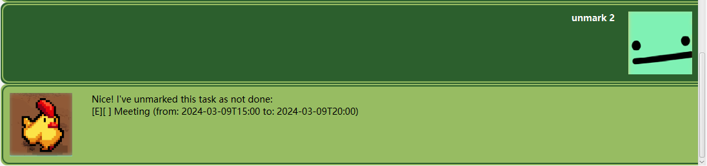
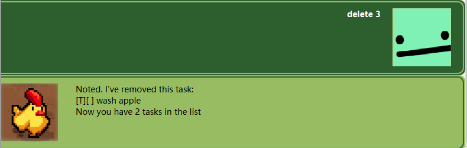

# Ping User Guide
🏖️ Thank you for looking through my iP project. 🏖️


🐤 Ping is a chatbot that helps you track your tasks in your life. 🐤

## Features

> [!IMPORTANT]
> Notes about how to use Ping:
> - Words that are in the upper `UPPER_CASE` are the parameters to be used by the user.
>    e.g. mark NUMBER, NUMBER is any number in the current list
> - number is allowed when used as a TASK. e.g. todo NUMBER, deadline NUMBER /by /dd/mm/yyyy,
>    event NUMBER /from 09/03/2024 1900 /to 09/03/2024 2000
> - There is a funny command BLAH can be used to talk to Ping.

## Add a task to your list: `todo`
A quick command to add a task to your list

**Format**: `todo TODO`

Examples:
```
todo clean the room
```
```
todo wash apple
```

An image example:


## Add a task with a deadline: `deadline`
Add a task with the time deadline

**Format**: `deadline TASK /by dd/mm/yyyy`

Examples:
```
deadline clear the room /by 09/03/2024
```
```
deadline submission /by 09/03/2024
```

An image example:


## Add a task with a start and end: `event`
Add a task with the start time and end time

**Format**: `event TASK /from dd/mm/yyyy HHmm /to dd/mm/yyyy HHmm`

Examples:
```
event clear the /from 09/03/2024 1900 /to 09/03/2024 2000
```
```
event Meeting the /from 09/03/2024 1900 /to 09/03/2024 2000
```

An image example:


## Mark a task that is done: `mark`
Mark a task that you have already done

**Format**: `mark NUMBER`

Examples:
```
mark 1
```
```
mark 2
```

An image example:


## Unmark a task: `unmark`
Unmark a task that is not done

**Format**: `unmark NUMBER`

Examples:
```
unmark 1
```
```
unmark 2
```

An image example:


## Delete a task in the list: `delete`
delete a task in the list

**Format**: `delete NUMBER`

Examples:
```
delete 1
```
```
delete 2
```

An image example:

