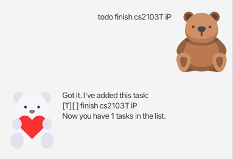

# User Guide
# Liv

Liv in an application that can manage a variety of tasks for you.

## Table of Content
- [Quick start](#quick-start)
- [Features](#features)
  - [Notes](#notes-)
    - [About the task type](#about-the-task-type)
    - [About the command format](#about-the-command-format)
    - [About the time format](#about-the-time-format)
    - [About saving data](#about-saving-data)
  - [Add a Todo task](#add-a-todo-task)
  - [Add a Deadline task](#add-a-deadline-task)
  - [Add an Event task](#add-an-event-task)
  - [Show the task list](#show-the-task-list)
  - [Mark task(s) as done](#mark-tasks-as-done)
  - [Mark task(s) as not done](#mark-tasks-as-not-done)
  - [Delete task(s) in the list](#delete-tasks-in-the-list)
  - [Delete all tasks in the list](#delete-all-tasks-in-the-list)
  - [Find tasks using a keyword](#find-tasks-using-a-keyword)

## Quick start
1. Ensure you have **Java 11** or above install in your Computer.
2. Download the latest `Liv.jar` [here](https://github.com/Kaya3842/ip/releases).
3. Copy the file to the folder you want to use as the home folder for your application.
4. Open a command terminal, `cd` into the folder you put the jar file in, and use the `java -jar Liv.jar`
   command to run the application. A **GUI** similar to the below should appear in a few seconds.

5. Type commands in the white box below and press **Enter** to execute it.
6. Refer to the Features below for the list of commands to use.

## Features

### Notes 
#### About the task type
There are 3 kinds of tasks that you can store in Liv: **TODO**, **DEADLINE** and **EVENT**.
- **TODO** tasks only have a description of the task.
- **DEADLINE** tasks have a description along with the date and time of the deadline itself.
- **EVENT** tasks have a description, along with two date and time. These indicate
  the start time and end time of the event.

#### About the command format
- Items in angle brackets are compulsory. For example, `todo <description>` means there must
be a description in the Todo task.
- Items with `...` after them means there can be multiple parameters of that type. For example,
`mark <number>...` means you can input multiple task numbers in one command.
- For commands that do not take in parameters (such as `list`, `clear`), it is important to type
that command exactly. Commands such as`list1` or `clearabc` will be considered invalid.

#### About the time format
The **only** date time format accepted as an input in your command is `yyyy-MM-dd HHmm`.
For example, `2024-03-27 2359` is a valid date time input, while `27-03-2024 2359` or 
`2024-03-27-23-59` are invalid, so they will not be added to the task list.

#### About saving data
Liv will automatically save your data whenever there is a change in the task list. For examples, 
when a new task is added or an existing task is deleted).

### Add a Todo task
Format: `todo <description>`

Adds a Todo task that contains a description to the list.

### Add a Deadline task
Format: `deadline <description> /by <date time>`

Adds a Deadline task that contains a description and the date time of the deadline to the list.

### Add an Event task
Format: `event <description> /from <date time> to <date time>`

Adds an Event task that contains a description, the starting date time and the ending date time
of the event to the list.

### Show the task list
Format: `list`

Show the list of all the tasks added.

### Mark task(s) as done
Format: `mark <number>...`

Mark the task(s) at the given number(s) as done. Marked tasks will have the `[X]` after their task 
type in the task list. You can use the `list` command to find the number of each task for the marking.

### Mark task(s) as not done
Format: `unmark <number>...`

Unmark the task(s) at the given number(s) so that the task(s) is/are considered not done.
Unmarked task will have the `[ ]` after their task type in the list. You can use the `list`
command to find the number of each task for the marking.

### Delete task(s) in the list
Format: `delete <number>...`

Delete the task(s) at the given number(s). You can use the `list` command to find the number
of each task for the marking.

### Delete all tasks in the list
Format: `clear`

Delete all tasks in the list.

### Find tasks using a keyword
Format: `find <keyword>`

Find and list all tasks whose description contain the given keyword.