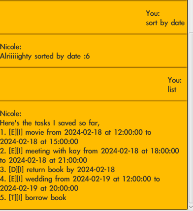

# Nicole [Mark 2] User Guide

Nicole is your smart task, deadline
and event manager! Give her commands using the formats
specified in this guide and 
look forward to easier days ahead :D

## Setting up

Simply follow these steps: 

1. Download the `Nicole.jar` file from [here](https://github.com/yashpola/ip/releases/tag/Level-10)
2. Navigate to your computer's `downloads` folder and
   - Create a folder to put the `jar` file in
   - Double-click the `jar` file to launch Nicole
   - Fire away!

Take note that when using Nicole, a `tasks.txt` file will
appear in the folder you created. This file will simply 
be used to save your items between sessions.

## Getting started

To know what basic commands Nicole can help you with, 
simply type-in `help` and you should see 
something like this:

Take note that when typing the actual commands, 
you should omit any square braces ([ ]) pictured above. 

You can find other helpful pointers below for a few of Nicole's commands.

## Adding an item

After adding an item in any of the following formats: 
1. `todo [task]`
2. `deadline [task] by YYYY-MM-DD`
3. `event [description] from YYYY-MM-DD at HH:MM:SS to YYYY-MM-DD at HH:MM:SS`

The item will appear in a `tasks.txt` file respectively in the following
formats: 
1. `[T][I] [task]`
2. `[D][I] [task] by YYYY-MM-DD`
3. `[E][I] [description] from YYYY-MM-DD at HH:MM:SS to YYYY-MM-DD at HH:MM:SS`

where `T, D, E` stand for `Todo`, `Deadline`, `Event` respectively
and `I` is the default status of the item
which is `Incomplete`.

## Marking, Unmarking, Deleting, and Updating items

Ensure you enter the correct item number for the item 
you are trying to `mark`, `unmark`, `delete` or `update`.
You can always ask Nicole to `list` 
first to check the items and their 
tasknumbers.

For example, if you wish to delete a `todo`, you
could `list`:

and then accordingly `delete 1` to see a confirmation:

In this particular case since `borrow book` was the only
item, no items remained after deleting it.

For `mark`, the `I` status of the item 
will change to `C` (meaning `Complete`), 
and vice versa for `unmark`.

## Adding Deadlines and Events

Basic notes 💡
- The specified formats of `by YYYY:MM:DD` for dedlines 
and `from YYYY:MM:DD at HH:MM:SS to YYYY:MM:DD at HH:MM:SS`
for events are strict! 

Potential triggers for errors ❌
- Adding events that overlap one another in any way
- Specifying date(time)s that precede the current date(time)
- Specifying a `to...at` datetime for events that precedes the 
`from...at` datetime

Nicole will indicate to you very clearly if you made 
any of the above errors and also guide you 
on how to rectify your command, so fret not!

**Note** that updating an event could also lead to 
problems with clashing events. When in doubt, `list` to 
peruse your current items first.

## Sorting

`sort by date` will rearrange your list
of items from earliest to latest as per their date(time) like so:

Where`Events` are sorted per their  `from` datetime

Note that since `todos` do not have a datetime, they are ordered
**last** by default.

## Finally...
Above all remember to ***have fun*** with Nicole!
She will help you as much as possible in error and save your
item history for ease of repeated use. 