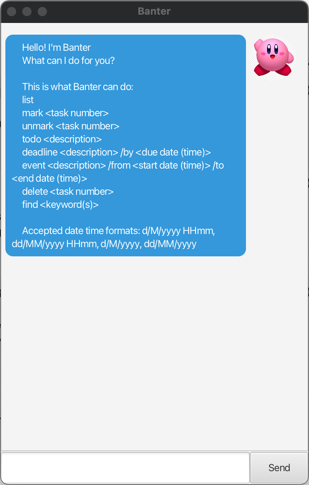

# Banter User Guide


Banter is an **app for managing tasks**, optimized for use via a **Command Line Interface (CLI)**, while still having 
the benefits of a **chatbot Graphical User Interface (GUI)**. If you can type fast, Banter can get your tasks 
management done faster than traditional GUI apps.

---------------------------------------

## Quick start

1. Ensure you have Java `11` or above installed in your Computer.
2. Download the latest `banter.jar` from [here](https://github.com/solomonng2001/ip/releases/tag/A-Release).
3. Copy the file to the folder you want to use as the home folder for Banter.
4. Open a command terminal, `cd` into the folder you put the jar file in, and use the `java -jar addressbook.jar` 
command to run the application. A GUI similar to the below should appear in a few seconds.<br>

5. Type the command in the command box and press Enter to execute it. e.g. typing `help` and pressing Enter will
6. Refer to the [Features](#features) below for details of each command.

---------------------------------------

## Command summary

| Action                          | Format, Examples                                                                                                                         |
|---------------------------------|------------------------------------------------------------------------------------------------------------------------------------------|
| Add todo                        | `todo <description>` <br> e.g. `todo read book`                                                                                          |
| Add deadline                    | `deadline <description> /by <date>` <br> e.g. `deadline return book /by 1/12/2024`                                                       |
| Add event                       | `event <description> /from <start date> /to <end date>` <br> e.g. `event project <br/>meeting /from 12/12/2024 0900 /to 12/12/2024 1800` |
| List all tasks                  | `list`                                                                                                                                   |
| Mark as done                    | `mark <task number>` <br> e.g. `mark 1`                                                                                                  |
| Unmark as not done              | `unmark <task number>` <br> e.g. `unmark 1`                                                                                              |
| Find matching tasks by keywords | `find <keyword>` <br> e.g. `find meeting project`                                                                                        |
| Delete task                     | `delete <task number>` <br> e.g. `delete 1`                                                                                              |

---------------------------------------

## Features

> [!NOTE]
> **Notes about the command format:**
> * The following date time formats are supported:
>   * `d/M/yyyy HHmm` (e.g. 1/12/2024 1800)
>   * `d/M/yyyy` (e.g. 1/12/2024)
>   * `dd/MM/yyyy HHmm` (e.g. 01/12/2024 1800)
>   * `dd/MM/yyyy` (e.g. 01/12/2024)
> * Words in `<angle brackets>` are the parameters to be supplied by the user.
> * Parameters must be in the order specified.
> * Extraneous parameters for commands that do not take in parameters (such as list) will be ignored.

### Adding todos

Adds a todo to the task list. Todos are tasks that need to be done, but do not have a deadline.

Format: `todo <description>`

Example: `todo read book`

Expected outcome:
```
Got it. I've added this task:
[T][ ] read book
Now you have 1 tasks in the list.
```

### Adding deadlines

Adds a deadline to the task list. Deadlines are tasks that need to be done by a certain date.

Format: `deadline <description> /by <date>`

Example: `deadline return book /by 1/12/2024`

Expected outcome:
```
Got it. I've added this task:
[D][ ] return book (by: 1/12/2024)
Now you have 2 tasks in the list.
```

### Adding events

Adds an event to the task list. Events are tasks that start and end at a certain time.

Format: `event <description> /from <start date> /to <end date>`

Example: `event project meeting /from 12/12/2024 0900 /to 12/12/2024 1800`

Expected outcome:
```
Got it. I've added this task:
[E][ ] project meeting (from: 12/12/2024 0900 to: 12/12/2024 1800)
Now you have 3 tasks in the list.
```

### Deleting tasks

Deletes a task from the task list.

Format: `delete <task number>`

Example: `delete 1`

Expected outcome:
```
Noted. I've removed this task:
[T][ ] read book
Now you have 2 tasks in the list.
```

### List all tasks

Shows a list of all tasks in the task list.

Format: `list`

Example: `list`

Expected outcome:
```
Here are the tasks in your list:
1. [D][ ] return book (by: 1/12/2024)
2. [E][ ] project meeting (from: 12/12/2024 0900 to: 12/12/2024 1800)
3. [T][ ] read book
```

### Mark as done

Marks a task as done.

Format: `mark <task number>`

Example: `mark 1`

Expected outcome:
```
Nice! I've marked this task as done:
[D][X] return book (by: 1/12/2024)
```

### Unmark as not done

Unmarks a task as done.

Format: `unmark <task number>`

Example: `unmark 1`

Expected outcome:
```
Nice! I've unmarked this task as not done:
[D][ ] return book (by: 1/12/2024)
```

### Find matching tasks by keywords

Finds tasks that match the given keywords. The search is case-insensitive. Keywords can be ordered in any way.

Format: `find <keyword>`

Example: `find meeting project`

Expected outcome:
```
Here are the matching tasks in your list:
1. [E][ ] project meeting (from: 12/12/2024 0900 to: 12/12/2024 1800)
```

> [!CAUTION]
> **Caution about editing stored data file:**
> Do not edit the data file `tasklist.txt` manually. If you do, Banter may not be able to read the file, 
> and you may lose your data or crash the program.
