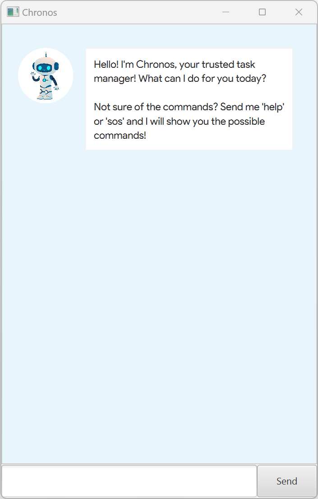

# Chronos User Guide

Chronos is a powerful task management application designed to streamline your workflow and boost productivity. 
With Chronos, you can effortlessly **organize your todos, deadlines, and events**, all in one intuitive platform. Optimised
for use via a Command Line Interface (CLI), Chronos can track your tasks faster than traditional GUI apps.

## Quick Start
1. Ensure you have `Java 11` or above installed in your Computer.
2. Download the latest `chronos.jar` from [here](https://github.com/triciiaaa/ip/releases).
3. Copy the file to the folder you want to use as the home folder for your Chronos application.
4. Open a command terminal, `cd` into the folder you put the jar file in, and use the `java -jar chronos.jar` 
command to run the application. A GUI similar to the below should appear in a few seconds. 
Note how the app contains some sample data.

## Features

### Viewing Help: `help` or `sos`
Shows a message containing the possible list of commands that a user can enter. 

Command Syntax: `help` or `sos`

### Listing Tasks: `list` or `ls`
Shows the list of tasks stored in the task list.

Command Syntax: `list` or `ls`

### Adding Todo: `todo` or `td`
Adds a todo into the task list.

Command Syntax: `todo DESCRIPTION` or `td DESCRIPTION`

Examples:
- `todo complete assignment`
- `td write proposal`

### Adding Deadline: `deadline` or `dl`
Adds a deadline into the task list.

Command Syntax: `deadline DESCRIPTION /by YYYY-MM-DD HH:MM` or `DL DESCRIPTION /by YYYY-MM-DD HH:MM`

Examples:
- `deadline return library book /by 2024-02-22 12:00`
- `dl return library book /by 2024-02-22 12:00`

### Adding Event: `event` or `ev`
Adds an event into the task list.

Command Syntax: `event DESCRIPTION /from YYYY-MM-DD HH:MM /to YYYY-MM-DD HH:MM` or 
    `ev DESCRIPTION /from YYYY-MM-DD HH:MM /to YYYY-MM-DD HH:MM`

Examples:
- `event concert /from 2024-02-16 18:00 /to 2024-02-16 20:00`
- `ev concert /from 2024-02-16 18:00 /to 2024-02-16 20:00`

### Marking Task As Completed: `mark` or `mk`
Marks a task at the specified index as completed.

Command Syntax: `mark INDEX` or `mk INDEX`

Examples:
- `mark 1` marks the 1st task in the task list.
- `mk 1` marks the 1st task in the task list.

Note:
- The index refers to the index number shown in the displayed task list.
- The index provided must be a positive integer i.e. 1, 2, 3 ...

### Unmarking Task: `unmark` or `umk`
Unmarks a task at the specified index as incomplete.

Command Syntax: `unmark INDEX` or `umk INDEX`

Examples:
- `unmark 1` unmarks the 1st task in the task list.
- `umk 1` unmarks the 1st task in the task list.

Note:
- The index refers to the index number shown in the displayed task list.
- The index provided must be a positive integer i.e. 1, 2, 3 ...

### Deleting Task: `delete` or `rm`
Deletes a task at the specified index from the task list.

Command Syntax: `delete INDEX` or `rm INDEX`

Examples:
- `delete 1` deletes the 1st task in the task list.
- `rm 1` deletes the 1st task in the task list.

Note:
- The index refers to the index number shown in the displayed task list.
- The index provided must be a positive integer i.e. 1, 2, 3 ...

### Finding Task: `find` or `f`
Finds a task with descriptions containing any of the given keyword(s).

Command Syntax: `find KEYWORD [MORE_KEYWORDS]` or `f KEYWORD [MORE_KEYWORDS]`

Examples:
- `find book`
- `f book`

Note:
- The keyword search is case-sensitive. 
- The order of the keywords does not matter. e.g. `return book` will match `book return`
- Only the description of the task can be searched.
- Only full words will be matched e.g. `project` will not match `projects`

### Exiting Program: `bye` 
Exits the program.

Command Syntax: `bye`

### Saving Data
The data provided by the user is saved in the hard disk automatically without any additional commands.
The automatic save happens after any command that changes the data.

## Command Summary

| Command         | Syntax                                                     |
|-----------------|------------------------------------------------------------|
| **Get Help**    | `help` or `sos`                                            |
| **Add Todo**    | `todo return book` or `td return book`                      |
| **Add Deadline**| `deadline DESCRIPTION /by YYYY-MM-DD HH:MM` or `dl DESCRIPTION /by YYYY-MM-DD HH:MM` |
| **Add Event**   | `event DESCRIPTION /from YYYY-MM-DD HH:MM /to YYYY-MM-DD HH:MM` or `ev DESCRIPTION /from YYYY-MM-DD HH:MM /to YYYY-MM-DD HH:MM` |
| **List Tasks**  | `list` or `ls`                                             |
| **Find Tasks**  | `find KEYWORD [MORE_KEYWORDS]` or `f KEYWORD [MORE_KEYWORDS]` |
| **Mark Task**   | `mark INDEX` or `mk INDEX`                                  |
| **Unmark Task** | `unmark INDEX` or `umk INDEX`                               |
| **Delete Task** | `delete INDEX` or `rm INDEX`                                |
| **Exit Program**| `bye`                                                      |

The structure of this user guide took considerable reference from the user guide of AB3, 
which can be found [here](https://se-education.org/addressbook-level3/UserGuide.html#features).
