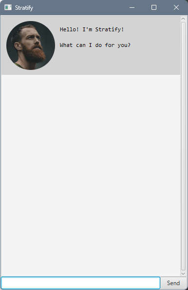

# Stratify: User Guide


>_Stratify is more than just a task organizer; it's a seamless experience designed to amplify your productivity._

A user-friendly, **command-line-input based interface** ensures 
efficient task handling without unnecessary complexities. 
Stratify empowers you to effortlessly manage your tasks, 
providing a streamlined approach to boost your productivity.
Easy to use, Stratify eliminates the learning curve. 
Dive in, follow a few simple steps, and let it transform how you manage your tasks.

<!-- For the links to work in both IntelliJ and GitHub pages, there should be a double space. -->
* [Quick Start](#quick-start)
* [Features](#features)
  * [Listing your task list: `list`](#listing-your-task-list--list)
  * [Ending the chat: `bye`](#ending-the-chat--bye)
  * [Adding todos: `todo`](#adding-todos--todo)
  * [Adding deadlines: `deadline`](#adding-deadlines--deadline)
  * [Adding events: `event`](#adding-events--event)
  * [Marking a task: `mark`](#marking-a-task--mark)
  * [Unmarking a task: `unmark`](#unmarking-a-task--unmark)
  * [Deleting a task: `delete`](#deleting-a-task--delete)
  * [Finding tasks: `find`](#finding-tasks--find)
  * [Undoing an action: `undo`](#undoing-an-action--undo)
  * [Resizing your chatbot](#resizing-your-chatbot)
  * [Editing the data file](#editing-the-data-file)
* [FAQ](#faq)
* [Commands: Quick reference](#commands--quick-reference)
  * [Command Syntax](#command-syntax)

---

## Quick Start

1. Ensure that you have Java 11 or above installed on your computer.
1. Download the latest `stratify.jar` from [here](https://github.com/tituschewxj/ip/releases).
1. Copy the jar file into the folder that you want to use as the home directory for Stratify.
1. Open up a command terminal, `cd` into the folder you put the jar file in, 
and use the `java -jar stratify.jar` command to run the application. 
A GUI similar to the below should appear.



---

## Features

### Listing your task list:  `list`

Displays your task list, with all your added tasks within.

> **Example**
>
> `list`
>
> * This lists all the tasks in your task list.

### Ending the chat:  `bye`

Ends the chat.

> **Example**
>
> `bye`
>
> * This ends the chat, disabling the input, and prompts the user to exit.

### Adding todos:  `todo`

Adds a named todo, into your task list.

> **Format**
> 
> `todo <name>`

> **Example**
> 
> `todo homework`
> 
> * This adds a todo of the name `homework` into your task list.

### Adding deadlines:  `deadline`

Adds a named deadline, with a by date, into your task list.

> **Format**
> 
> `deadline <name> /by <by_date>`
> 
> * The `<by_date>` does not need to be a date, but can be formatted as a date.
>   * The supported date formats are `MMM d yyyy` and `yyyy-MM-dd`.

> **Example**
> 
> `deadline read book /by Friday`
> 
> * This adds a deadline of the name `read book`, 
> with a deadline by `Friday` into your task list.

### Adding events:  `event`

Adds a named event, with, into your task list.

> **Format**
> 
> `event <name> /from <start_date> /to <end_date>`
> 
> * The `<start_date>` and `<end_date>` do not need to be dates, but can be formatted as dates.
>   * The supported date formats are `MMM d yyyy` and `yyyy-MM-dd`.

> **Example**
> 
> `event cs2103t tutorial /from 1pm /to 2pm`
> 
> * This adds an event of the name `cs2103t tutorial`,
> with the start date at `1pm` and end date at `2pm`, 
> into your task list.

### Marking a task:  `mark`

Marks a task as complete.

> **Format**
>
> `mark <index>`
>
> * The <index> must be a valid index from the task list,
> meaning that the task must exist.

> **Example**
>
> `mark 1`
>
> * This marks the first task from your task list.

### Unmarking a task:  `unmark`

Marks a task as incomplete.

> **Format**
>
> `unmark <index>`
>
> * The <index> must be a valid index from the task list,
> meaning that the task must exist.

> **Example**
>
> `unmark 1`
>
> * This marks the first task from your task list.

### Deleting a task:  `delete`

Deletes a task from your task list.

> **Format**
>
> `delete <index>`
>
> * The <index> must be a valid index from the task list,
> meaning that the task must exist.

> **Example**
> 
> `delete 1`
> 
> * This deletes the first task from your task list.

### Finding tasks:  `find`

Finds a task from your task list.

> **Format**
>
> `find <name>`

> **Example**
>
> `find work`
>
> * This finds and displays all tasks with the substring 
> `work` in it, such as `homework`, `working`, or just `work`, 
> in the name of the task.
> * It doesn't find from other argument values, such as `<by_date>` in a deadline.

### Undoing an action:  `undo`

Undoes a change that you have made.

> **Format**
>
> `undo [/by <steps>]`
>
> * `/by <steps>` is an optional argument, so it does not have to be included. 
> By default, if not included, it rolls back one change at a time.
> * The `<steps>` is the number of steps to rollback by, which should be a positive integer.
> * You can only undo changes from the current session.

> **Example**
>
> User inputs:
> ```
> todo assignment 
> undo
> ```
>
> * This undoes the previous change, which is creating a todo called `assignment`,
> * The task list is rolled back to its previous state, before that todo was created.

> **Example**
>
> User inputs:
> ```
> todo assignment
> list
> deadline homework /by tomorrow
> undo 2
> ```
>
> * This undoes the previous two changes, which is creating a deadline called `homework` 
> and a todo called `assignment`. 
> * `list` does not modify the anything, so is not included as a change.
> * The task list is rolled back to its previous state, before the todo and deadline were created.

### Resizing your chatbot

The chatbot can be resized to fit your screen, by resizing the window.

### Editing the data file

The data is saved as a human-readable file in `[JAR file location]/data/save.txt`. 
Advanced users can modify the data file directly.

> **Caution**
> 
> If the format of the save file is invalid, your save file will be discarded and replaced with a new save file,
> with an empty task list. It is recommended to have a backup of your save file if you have modified it directly.

---

## FAQ

> **Q**: How can I undo a change that I made?
> 
> **A**: Use the `undo` command to roll back your change.

> **Q**: How can I transfer my data to another device?
>
> **A**: Copy over the save file, and your data should be transferred.

> **Q**: Why does save file fail to load?
>
> **A**: Your save file is either in the wrong format, or stored in the wrong location.
 
> **Q**: How can I tell if my command was successful?
>
> **A**: If your command is successful, there will be a success message. Otherwise, there would be an error message.

---

## Commands:  Quick reference

| Command                                   | Format                                           |
|-------------------------------------------|--------------------------------------------------|
| [`list`](#listing-your-task-list--list)   | `list`                                           |
| [`bye`](#ending-the-chat--bye)            | `bye`                                            |
| [`todo`](#adding-todos--todo)             | `todo <name>`                                    |
| [`deadline`](#adding-deadlines--deadline) | `deadline <name> /by <by_date>`                  |
| [`event`](#adding-events--event)          | `event <name> /from <start_date> /to <end_date>` |
| [`mark`](#marking-a-task--mark)           | `mark <index>`                                   |
| [`unmark`](#unmarking-a-task--unmark)     | `unmark <index>`                                 |
| [`delete`](#deleting-a-task--delete)      | `delete <index>`                                 |
| [`find`](#finding-tasks--find)            | `find <name`                                     |
| [`undo`](#undoing-an-action--undo)        | `undo [/by <steps>]`                             |

### Command Syntax

**Commands:**
Command refers to some text that a user can input, which results in the execution of some action,
and displays something in the chat. The execution can be either successful or unsuccessful (gives error message).
* `name` refers to a word, or a group of words, that are within brackets or after a forward slash.
    * The `name` at the start of a command refers to the name of the command.
    * `name`s are trimmed, whitespace before and after it are removed.
* Square brackets (`[`, `]`) around an argument represents an **optional** argument, which does not have to be included.
* Angled brackets (`<`, `>`) around a `name` represents the name of the value of the argument.
* Forward slash `/` followed by a `name` represents the name of the argument.

**Arguments:**
Argument refers to some text that starts with a forward slash, followed by possibly brackets, in the command line.
* For example, in a deadline command, `/by today` is an argument with the name `by` and passes the value `today`.
  The name of the value is `by_date`.
* Arguments can be in **any** order, for example, `event cs2103t tutorial /to 2pm /from 1pm`.
* If the **same** argument is provided more than once, only the first instance of that argument is read.
  For example, in `deadline cs2103t quiz /by today /by tomorrow`, the `by_date` is read as `today`,
  and `tomorrow` is ignored.
* Invalid or missing arguments (and their values), will display an error to the user.
