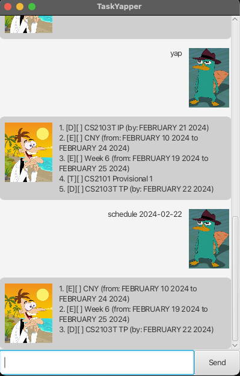

# Jayne Android User Guide

Jayne Android is a versatile task management application designed to help you organize your tasks efficiently. With a simple and intuitive interface, Jayne Android allows you to add, manage, and sort your tasks with ease. Whether you're planning your day, managing projects, or setting reminders, Jayne Android provides you with the tools you need to stay on top of your tasks.

## Jayne Android First Look

## How it works

1. There are 3 commands in that Jayne recognises. 
   1. Todo
   2. Deadline
   3. Event
2. Type in the activity that you want Jayne to keep track.
3. Jayne will add your activity in a list.
4. She will also create a `text file` and store your activities.
5. More commands will be listed below.

## Feature

### Adding Tasks
Jayne Android supports three types of tasks: Todo, Deadline, and Event. Each task type is tailored to suit different needs and preferences.

1. **Todo**: A basic task with a description. Perfect for quick reminders or simple tasks.
   - Command: `todo [task description]`
   - Example: `todo Read a book` 

2. **Deadline**: A task with a due date. Ideal for tasks that need to be completed by a specific time.
   - Command: `deadline [task description] /by [YYYY-MM-DD]`
   - Example: `deadline Submit assignment /by 2024-03-01`

3. **Event**: A task with a start and end date. Suitable for events or activities happening over a period.
   - Command: `event [task description] /from [YYYY-MM-DD] /to [YYYY-MM-DD]`
   - Example: `event Conference /from 2024-04-01 /to 2024-04-03`

4. **Viewing Tasks**: You can view all your tasks in a list, giving you a clear overview of what needs to be done.
   - Command: `list`

3. **Deleting Tasks**
   Remove tasks that are no longer needed or have been completed.
   - Command: `delete [task number]`
   - Example: `delete 3`

4. **Sorting**: Organize your tasks based on type, completion status, or due date to prioritize your workload effectively.
   - Sort by Type: Groups tasks by their type (`Todo`, `Deadline`, `Event`).
   - Command: `sort type`
   - Sort by Mark Status: Separates completed tasks from those still pending.
   - Command: `sort mark `
   - Sort by Due Date: Arranges tasks starting from the earliest due date or event start date.
   - Command: `sort due`

5. **Marking Tasks as Done:** Mark tasks as completed once you've finished them.
   - Command: `mark [task number]`
   - Example: `mark 1`

6. **Adding Flexibility** Jayne Android supports flexible commands for adding tasks, making task management quick and effortless.
   - Command: `add [task type] [task details]`
   - Examples:
   - `add todo Buy groceries`
   - `add deadline File taxes /by 2024-04-15`
   - `add event Vacation /from 2024-07-01 /to 2024-07-14`

## Getting Started  
To get started with Jayne Android, simply download the app from the Google Play Store. Once installed, open the app, and you'll be greeted with a simple interface where you can begin adding and managing your tasks immediately.