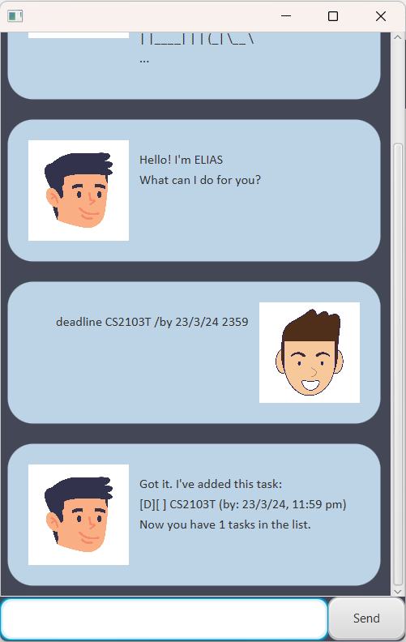

# CoDriver User Guide

 <br>

Welcome to CoDriver! CoDriver is a desktop application for managing your tasks and deadlines. <br>
It is optimized for use via a Command Line Interface (CLI) while still having the benefits of a Graphical User Interface 
(GUI). 
If you can type fast, CoDriver can help you manage your tasks faster than traditional GUI apps.

## Adding a Todo `todo`
Add a todo task to the list.

Example: `todo <task description>`<br>
Expected output:
```
Got it. I've added this task:
[T][] <task description>
Now you have <number of tasks> tasks in the list.
```
On a successful operation, the task will be added to the list and the number of tasks will be displayed. <br>

## Adding deadlines `deadline`
Add a deadline task to the list. The date should be in the format `YYYY-MM-DD`. <br>

Example: `deadline <task description> /by <date>`<br>
Expected output:
```
Got it. I've added this task:
[D][] <task description> (by: <date>)
Now you have <number of tasks> tasks in the list.
```
On a successful operation, the task will be added to the list and the number of tasks will be displayed. <br>

## Adding events `event`
Add an event task to the list. The dates should be in the format `YYYY-MM-DD`. <br>

Example: `event <task description> /from <start date> /to <end date>`<br>
Expected output:
```
Got it. I've added this task:
[E][] <task description> (from: <start date> to: <end date>)
Now you have <number of tasks> tasks in the list.
```
On a successful operation, the task will be added to the list and the number of tasks will be displayed. <br>

## Listing all tasks `list`
List all tasks in the list.

Example: `list`<br>
Expected output:
```
Here are the tasks in your list:
1. [T][] <task description>
...
```
On a successful operation, all tasks in the list will be displayed. <br>

## Marking a task as done `mark`
Mark a task as done. The task number is the index of the task in the list.

Example: `mark <task number>`<br>
Expected output:
```
Nice! I've marked this task as done:
[T][X] <task description>
```
On a successful operation, the task will be marked as done and the updated task will be displayed. <br>

## Marking a task as not done `unmark`
Mark a task as not done. The task number is the index of the task in the list.

Example: `unmark <task number>`<br>
Expected output:
```
Ok, I've marked this task as not done yet:
[T][] <task description>
```
On a successful operation, the task will be marked as not done and the updated task will be displayed. <br>

## Deleting a task `delete`
Delete a task from the list. The task number is the index of the task in the list.

Example: `delete <task number>`<br>
Expected output:
```
Noted. I've removed this task:
[T][] <task description>
Now you have <number of tasks> tasks in the list.
```
On a successful operation, the task will be removed from the list and the number of tasks will be displayed. <br>

## Finding tasks `find`
Find tasks that contain the given keyword.

Example: `find <keyword>`<br>
Expected output:
```
Here are the matching tasks in your list:
1. [T][] <task description>
...
```
On a successful operation, all tasks that contain the keyword will be displayed. <br>

## Exiting the program `bye`
Exit the program. You must use this command to save the tasks to the hard disk.

Example: `bye`<br>
Expected output:
```
Bye. Hope to see you again soon!
```
On a successful operation, the program will exit. <br>

## Detect Duplicates
CoDriver will detect and prevent the addition of duplicate tasks. It will not allow you to add a duplicate task
that is already in the list.
