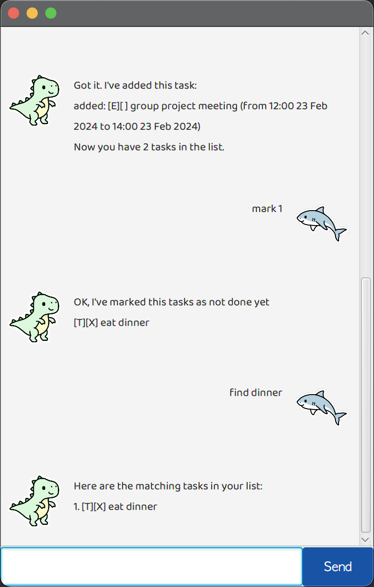

# Felix



## Introducing Felix, Your Personal Task Manager and Note-Taking Assistant.

Meet Felix, your versatile and reliable chatbot designed to streamline your task management and note-taking experience. With Felix by your side, staying organized, productive, and on top of your priorities has never been easier.

## Tasks Management

Tasks are split into 3 different types, namely:
1. To-dos
2. Deadlines
3. Events

Each type of task is handled differently by Felix, so be sure to check below for more details! ^.^

### To-dos
To-dos are for tasks with no due date or timings. Here's how we can add a new To-do:

>**todo** _DESCRIPTION_

- Replace _DESCRIPTION_ with your description for your To-do task. 

Examples:
>**todo** Fix the door handle.

Felix will confirm that you have added the To-do to the list of tasks if you entered the command correctly.

`Cool! Adding new task: [T][] Fix the door handle`


### Deadlines
Deadlines are for tasks with a due date. Here's how we can add a new Deadline:

>**deadline** _DESCRIPTION_ **/by** _DATE_

- Replace _DESCRIPTION_ with your description for your Deadline task.
- Replace DATE with a valid date in YYYY-MM-DD format.
- Include **/by** as a separator for you to specify your date after.

Examples:
>**deadline** Submit iP final version **/by** 2024-02-23
>
>**deadline** Submit PS4 by Friday **/by** 2024-02-26

Felix will confirm that you have added the Deadline to the list of tasks if you entered the command correctly.

`Cool! Adding new task: [D][] Submit iP final version (by: Feb 23 2024) `

### Events
Events are for tasks that lasts for a specific period of time. Here's how we can add a new Event:

>**event** _DESCRIPTION_ **/from** _DATE_ **/to** _DATE_

- Replace _DESCRIPTION_ with your description for your Event task.
- Replace DATE with a valid date in YYYY-MM-DD format.
- Include **/from** as a separator for you to specify your **from** date after.
- Include **/to** as a separator for you to specify your **to** date after.

Examples:
>**event** John's Birthday Party **/from** 2024-03-20 **/to** 2024-03-21
>
>**event** Career fair **/from** 2024-02-26 **/to** 2024-02-28

Felix will confirm that you have added the Event to the list of tasks if you entered the command correctly.

``
Cool! Adding new task: 
[E][] John's Birthday Party (from: Feb 20 2024 to: Feb 21 2024) 
``


#### Nice! We've added some tasks. Now what can we do with them?

### List
This command lists all the tasks you have added so far.

>**list**

- No additional parameters are required.

Felix will display a list of all the tasks you have added and saved.

````
Here are all your tasks so far! ^.^:
1. [T][ ] Cook dinner
2. [D][X] Wash Laundry (by: Oct 20 2024)
````


### Delete
This command deletes a tasks at the specified index.

>**delete** _INDEX_

- Replace _INDEX_ with the index number of the task you want to delete.

Example:

If you have the following list:
````
Here are all your tasks so far! ^.^:
1. [T][ ] Cook dinner
2. [D][X] Wash Laundry (by: Oct 20 2024)
````
Then using the following command:
>**delete** 1

Felix will say:

````
Okay. Deleting the task: [T][ ] Cook dinner
````

Which will result in the following list:
````
Here are all your tasks so far! ^.^:
1. [D][X] Wash Laundry (by: Oct 20 2024)
````

### Find
This command find a tasks matching a given keyword or substring.

>**find** _WORD_

- Replace _WORD_ with the keyword.

Example:

If you have the following list:
````
Here are all your tasks so far! ^.^:
1. [T][ ] Cook dinner
2. [D][X] Wash Laundry (by: Oct 20 2024)
````
Then using the following command:
>**find** Wash

Felix will say:

````
Here are the matching tasks in your list:
1. [D][X] Wash Laundry (by: Oct 20 2024)
````


### Mark

This command find marks a task as done.

>**mark** _INDEX_

- Replace _INDEX_ with the index number of the task you want to mark as done.

Example:

If you have the following list:
````
Here are all your tasks so far! ^.^:
1. [T][ ] Cook dinner
2. [D][X] Wash Laundry (by: Oct 20 2024)
````
Then using the following command:
>**mark** 1

Felix will say:

````
Great job agent 47. Marking this task as DONE:
[T][X] Cook dinner
````

Resulting in the following list:
````
Here are all your tasks so far! ^.^:
1. [T][X] Cook dinner
2. [D][X] Wash Laundry (by: Oct 20 2024)
````
### Unmark
This command find marks a task as not done.

>**unmark** _INDEX_

- Replace _INDEX_ with the index number of the task you want to mark as not done.

Example:

If you have the following list:
````
Here are all your tasks so far! ^.^:
1. [T][X] Cook dinner
2. [D][X] Wash Laundry (by: Oct 20 2024)
````
Then using the following command:
>**unmark** 2

Felix will say:

````
Alright, marking this task as NOT DONE:
[D][ ] Wash Laundry (by: Oct 20 2024)
````

Resulting in the following list:
````
Here are all your tasks so far! ^.^:
1. [T][X] Cook dinner
2. [D][ ] Wash Laundry (by: Oct 20 2024)
````

## Felix can help you take basic notes too.

## Note
This command will create a new note and add it to a list of your notes.

>**note** _DESCRIPTION_

- Replace _DESCRIPTION_ with whatever you need to note down.

Example:

>**note** Jasper hates the colour green!

Felix will say:

````
Cool! Adding new note:
Note: Jasper hates the colour green!
````

## Notes
This command lists all the notes you have added so far.

>**notes**

- No additional parameters are required.

Felix will display a list of all the notes you have added and saved.

````
Here are all your notes so far! ^.^:
1. Note: Josh Birthday is on Sunday.
2. Note: Jasper hates the colour green!
````

## Remove
This command removes a note at the specified index.

>**remove** _INDEX_

- Replace _INDEX_ with the index number of the note you want to remove.

Example:

If you have the following list:
````
Here are all your notes so far! ^.^:
1. Note: Josh Birthday is on Sunday.
2. Note: Jasper hates the colour green!
````
Then using the following command:
>**remove** 1

Felix will say:

````
Okay. Deleting the note: Note: Josh Birthday is on Sunday.
````

Which will result in the following list:
````
Here are all your notes so far! ^.^:
1. Note: Jasper hates the colour green!
````

