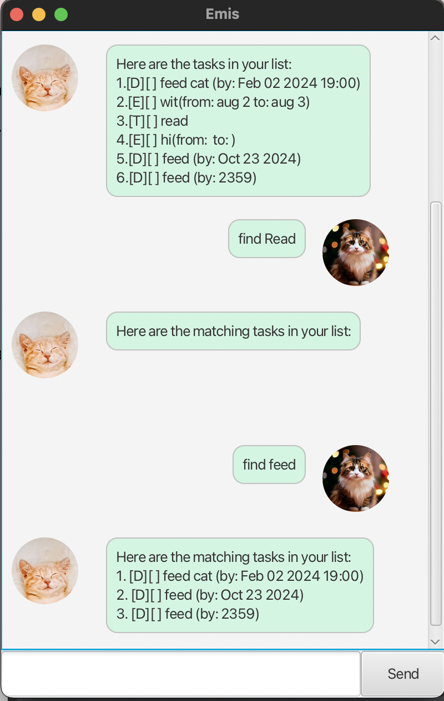

# Emis User Guide

Emis is a **desktop app for managing tasks** while still having the benefits of a Graphical User Interface (GUI).

# Quick start
1. Ensure you have Java '11' or above installed in your computer.
2. Download the latest emis.jar
3. Copy the file to the folder you want to use as the *home folder* for Emis.
4. Open a command terminal, 'cd' into the folder you put the jar file in, and use the 'java -jar emis.jar' command to run the application.

## Viewing help : 'help'
Shows the list of commands Emis can execute and how to use them.

Format: 'help'

## Adding deadlines : 'deadline'
Adds a deadline to the list of tasks.

Format: 'deadline TASK /by DATE'

Examples: 
- deadline feed cat /by 25/02/2024
- deadline feed myself /by 2024-02-25 1200
- deadline feed family /by today

Expected Outcomes:
- [D][] feed cat (by: Feb 25 2024)
- [D][] feed myself (by: Feb 25 2024 12:00)
- [D][] feed family (by: today)

## Adding events : 'event'
Adds an event to the list of tasks.

Format: 'event EVENT /from FROM /to TO'

Examples: 
- event feed myself /from 12pm /to 2pm
- event feed family /from  /to 

Expected Outcomes:
- [E][] feed myself (from: 12pm to: 2pm)
- [E][] feed family (from: to: )

## Adding Todo : 'todo'
Adds a todo task to the list of tasks.

Format: 'todo TODO'

Examples: 
- todo feed cat

Expected Outcomes:
- [T][] feed cat

## Deleting tasks : 'delete'
Deletes the specified task from the list of tasks.

Format: 'delete INDEX'
- The index refers to the index number shown in the list of tasks
- The index **must be a positive integer** 1, 2, 3, ...

## Finding tasks: 'find'
Find tasks that contains the keyword, even if partially.

Format: 'find KEYWORD'
- The search is case-sensitive
- Only the description is searched

Examples: 
- find feed

Expected Outcomes:

## Printing current tasks: 'list'
Prints the current list of tasks.

Format: 'list'

## Marking tasks as done : 'mark'
Marks a task as done.

Format: 'mark INDEX'
- The index refers to the index number shown in the list of tasks
- The index **must be a positive integer** 1, 2, 3, ...

Examples: 
- mark 1

Expected Outcomes:
- [T][X] feed cat

## Marking tasks as not done : 'unmark'
Marks a task as not done.

Format: 'unmark INDEX'
- The index refers to the index number shown in the list of tasks
- The index **must be a positive integer** 1, 2, 3, ...

Examples: 
- unmark 1

Expected Outcomes:
- [T][] feed cat

## Exiting Emis: 'bye'
Exits Emis.

Format: 'bye'
