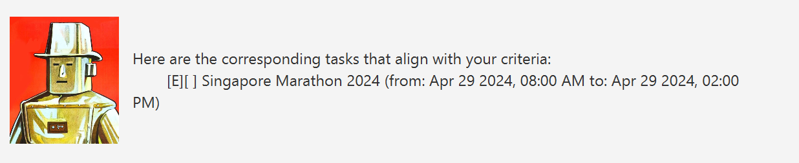
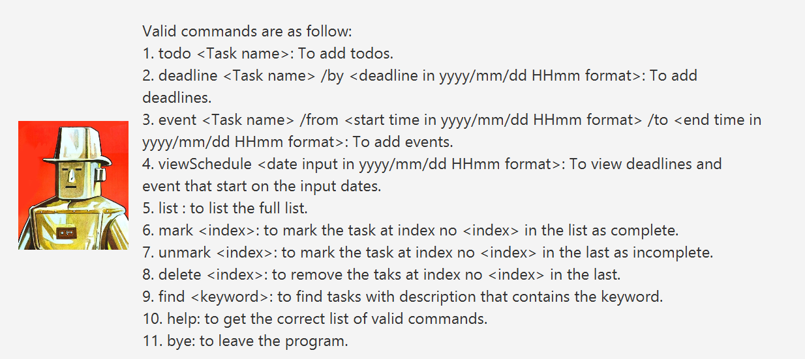

# Alfred User Guide

Alfred is a task manager chat bot based on the Duke chat bot. 
It can help users to remember different type of tasks which includes todos, deadlines and events.
It also has a marking feature to mark a tasks as done for task tracking and other commands to help
make the task managing a smooth experience.

## Adding todos

Adds the todo with the input task name into the task list.

Command: `todo <task name>`

Example: `todo exercise`

Expected Output:

## Adding deadlines

Adds the deadline with the input name and deadline into the task list.

Command: `deadline <task name> /by <date in yyyy/mm/dd HHmm format>`

Example: `deadline lab assignemnt-3 /by 2024/03/05 2359`

Expected Output:

## Adding events

Adds the events with the input name, start date and end date into the task list.

Command: `event <task name> /from <date in yyyy/mm/dd HHmm format> /to <date in yyyy/mm/dd HHmm format>`

Example: `event Singapore Marathon 2024 /from 2024/04/29 0800 /to 2024/04/29 1400`

Expected Output:

## Viewing Schedule

Displays the deadlines with the same date as the input date,
and events with the same start date as the input date.

Command: `viewSchedule <date in yyyy/mm/dd format>`

Example: `viewSchedule 2024/03/05`

Expected Output:

## Listing Tasks

Displays the all the tasks that have been added. *Note: the tasks added are stored in the disk and will be accessible even if the app closes.*

Command: `list`

Expected Output:

## Marking Tasks

Marks the tasks at the input index as completed.

Command: `mark <index of the task in the list>`

Example: `mark 7`

Expected Output:

## Un-marking Tasks

Un-marks the tasks at the input index as completed.

Command: `unmark <index of the task in the list>`

Example: `unmark 7`

Expected Output:

## Deleting Tasks

Delete the tasks at the input index as completed.

Command: `delete <index of the task in the list>`

Example: `delete 7`

Expected Output:

## Finding Tasks

Find the tasks with name/description that contains the input keyword.
*Note: The keyword is case sensitive*

Command: `find <keyword>`

Example: `find Marathon`

Expected Output:

## Getting help

Displays a summary of the valid commands

Command: `help`

Expected Output:

## Exiting Alfred

Exits the app.

Command: `bye`